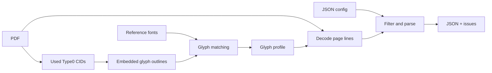

# Vietnamica Alignment

Extract structured Vietnamese inscription data from PDFs whose embedded-font text mapping is unreliable.

[](pyproject.toml)
[](pyproject.toml)
[](#output)

[🇻🇳 Tiếng Việt](README.vi.md)

> `PDF text extraction` · `Type0 CID decoding` · `glyph-outline profiles` · `JSON output`

## What it does

Some PDFs store visible text as character identifiers (CIDs) in embedded subset fonts, rather than reliable Unicode characters. Vietnamica Alignment recovers supported glyphs by matching their outlines to a generated glyph profile, then turns the decoded text into structured JSON records.

The extraction command takes a PDF and a document config. Its glyph profile is a cache built by `text_extraction.glyph_profile` from the same PDF/config; it writes a UTF-8 JSON array of inscription records plus a separate issue file for review. It does not use OCR or modify the source PDF.

## Quick start

Requirements: Python 3.11+, [uv](https://docs.astral.sh/uv/), the project dependencies, and suitable reference fonts in `fonts/`.

```bash
uv sync --frozen
```

Create a config for the document, build its glyph profile, then extract:

```bash
uv run python -m text_extraction.glyph_profile \
  --config configs/your-document.json

uv run python -m text_extraction.main \
  --config configs/your-document.json
```

Both commands discover matching embedded/reference fonts and refresh `encoded_fonts` first. The profile command then writes the glyph profile; the extraction command writes both JSON outputs. Run them from the repository root.

## Optional text localization

[`text_detection/`](text_detection/) is an isolated AutoHDR Stage 1 adapter.
It detects ordinary and damaged character boxes in one image, fuses them, and
returns a layout-aware reading order. Its CLI writes the boxes, intact/damaged
status, and reading-order IDs to JSON; it does not recognize characters. Its
model assets and MMDetection runtime are external; see its
[setup instructions](text_detection/README.md).

## How it works



1. The profile builder scans eligible Type0 PDF resources and profiles only CIDs actually used by the document.
2. It converts outlines to SVG path commands, derives a short SHA-256 signature, and selects a Unicode candidate from a matching local reference font by raster comparison.
3. The extractor recreates each supported CID outline signature and looks up its Unicode character in the profile.
4. It removes configured page furniture/footnotes and parses titles, metadata, markers, and sections into records.

## Configuration

Use [`configs/tap_1.json`](configs/tap_1.json) as the schema example. Every document rule and the source PDF are declared in the config. Paths are resolved relative to the config file.

```json
{
  "input_pdf_path": "../input/document.pdf",
  "paths": {
    "output_json": "../output/document.json",
    "glyph_profile": "../data/glyph_profiles/document.json"
  },
  "encoded_fonts": {"NomNaTong": "../fonts/NomNaTong.ttf"},
  "page_filter": {
    "margins": {"top": 40.0, "bottom": 45.0},
    "footnotes": null
  },
  "records": {
    "title_pattern": "^VĂN BIA SỐ\\s+(?P<number>\\d+)\\s*$",
    "metadata": [
      {"label": "Tên bia", "field": "ten_bia", "type": "string", "required": true}
    ],
    "content": {
      "start_heading": "Nguyên văn chữ Hán Nôm",
      "section_headings": ["Nguyên văn chữ Hán Nôm", "Phiên âm Hán Việt"]
    },
    "face_marker_pattern": "^\\s*<\\s*(?P<id>\\d+)\\s*>?\\s*(?P<rest>.*)$",
    "require_consecutive_numbers": true
  }
}
```

| Field | Purpose |
| --- | --- |
| `input_pdf_path` | Source PDF for discovery, profile building, and text extraction. |
| `paths` | Output JSON and generated glyph profile. |
| `encoded_fonts` | Generated mapping of embedded PDF font name to its exact local reference-font file. |
| `page_filter.margins` | Explicit top and bottom page exclusion sizes. |
| `page_filter.footnotes` | A filter object with `start_pattern` and `max_font_size`, or `null` to disable it. |
| `records.title_pattern` | Record-title regex; must include named group `number`. |
| `records.metadata` | Metadata labels and output fields. `identifiers` parses `<digits>` values. |
| `records.content` | Start heading and permitted section headings. |
| `records.face_marker_pattern` | Face-marker regex; must include named group `id`. |
| `records.require_consecutive_numbers` | Explicitly enables or disables sequence validation. |

Before each run, the pipeline scans the configured PDF and `fonts/`, then refreshes `encoded_fonts` with every compatible match. Profile construction opens only those configured reference files; it does not scan `fonts/` again. Unknown, legacy, or omitted fields are rejected; there are no document-specific code defaults. `expected_record_count` was removed because it couples a reusable document config to a particular PDF edition or fixture.

## Output

The primary output is one compact JSON array. Every record ends with `noi_dung`.

```json
[
  {
    "so_van_bia": 1,
    "ten_bia": "[Vô đề]",
    "ky_hieu_vnchn": ["12305"],
    "noi_dung": [
      {
        "ky_hieu": "12305",
        "chuyen_muc": [
          {"tieu_de": "Nguyên văn chữ Hán Nôm", "van_ban": "…"}
        ]
      }
    ]
  }
]
```

The CLI also writes `<output-stem>_invalid.json` by default. It contains malformed records, parser warnings, and global sequence violations. Records with parser warnings are excluded from the primary output by default.

### Extraction options

| Option | Description |
| --- | --- |
| `--config PATH` | Required document config. |

## Repository layout

| Path | Description |
| --- | --- |
| `text_extraction/main.py` | End-to-end config-driven PDF-to-JSON workflow and CLI. |
| `text_extraction/font_discovery.py` | Finds embedded CID fonts and updates exact local reference-file mappings. |
| `text_extraction/glyph_profile.py` | Builds the CID-to-Unicode glyph profile from configured mappings. |
| `text_extraction/config.py` | Loads and validates document configuration and glyph-profile JSON. |
| `text_extraction/types.py` | Immutable pipeline data contracts. |
| `text_extraction/pdf_glyphs.py` | Reads embedded font outlines shared by profile building and decoding. |
| `text_extraction/decoder.py` | Decodes PDF spans into normalized text lines. |
| `text_extraction/parser.py` | Converts decoded lines into inscription records and review issues. |
| `text_extraction/output.py` | Validates, formats, and atomically writes JSON output. |
| `text_detection/` | Optional AutoHDR Stage 1: detects normal/damaged character boxes, orders them, and writes one-image JSON. It does not recognize text. |
| `configs/` | Per-document parser and filter rules. |
| OCR / recognition | Not used or loaded. |
| `fonts/` | Local Unicode reference fonts. |
| `tests/` | Unit and integration tests. |

## Limitations

- Supported profile building is limited to Type0 `cff`, `cid`, `ttf`, and `otf` resources with `Identity-H`/`Identity-V` two-byte CIDs.
- Type1/simple fonts, unsupported CMaps, and non-identity Type0 `CIDToGIDMap` cases are not decoded.
- The raster matcher has no confidence threshold; profile output should be reviewed.
- Content-stream recognition handles specific `Tf`/`Tj`/`TJ` patterns, not every valid PDF construction.

## Verify

```bash
uv run python -m unittest discover -s tests -v
```

The unit suite covers font discovery, profile utilities, PDF text parsing,
JSON output, and text-detection result assembly.

## Extending

For a new collection, add a config with its `input_pdf_path` and an empty `encoded_fonts` object, then run `text_extraction.glyph_profile` followed by `text_extraction.main`. The first command discovers compatible local fonts and creates the profile. Extend `text_extraction/pdf_glyphs.py` and add focused tests when supporting a new font/CMap or text-show form, so discovery, profile building, and decoding remain compatible.
