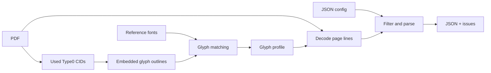

# Vietnamica Alignment

Extract structured Vietnamese inscription data from PDFs whose embedded-font text mapping is unreliable.

[](pyproject.toml)
[](pyproject.toml)
[](#output)

[🇻🇳 Tiếng Việt](README.vi.md)

> `PDF text extraction` · `Type0 CID decoding` · `glyph-outline profiles` · `JSON output`

## What it does

Some PDFs store visible text as character identifiers (CIDs) in embedded subset fonts, rather than reliable Unicode characters. Vietnamica Alignment recovers supported glyphs by matching their outlines to a generated glyph profile, then turns the decoded text into structured JSON records.

It takes a PDF, a document config, and a glyph profile. It writes a UTF-8 JSON array of inscription records plus a separate issue file for review. It does not use OCR or modify the source PDF.

## Quick start

Requirements: Python 3.10+, [uv](https://docs.astral.sh/uv/), the project dependencies, and suitable reference fonts in `fonts/reference/`.

```bash
uv sync --frozen
```

Create a config for the document, build its glyph profile, then extract:

```bash
uv run python tools/build_glyph_profiles.py \
  --pdf input/your-document.pdf \
  --output data/glyph_profiles/your-document.json \
  --config configs/your-document.json

uv run python extract_pdf.py \
  --config configs/your-document.json \
  --pretty-output output/your-document.pretty.json
```

Run commands from the repository root. The profile builder does not create the parent directory of `--output`; create it first. The extraction command creates parents for its output files.

## How it works



1. The profile builder scans eligible Type0 PDF resources and profiles only CIDs actually used by the document.
2. It converts outlines to SVG path commands, derives a short SHA-256 signature, and selects a Unicode candidate from a matching local reference font by raster comparison.
3. The extractor recreates each supported CID outline signature and looks up its Unicode character in the profile.
4. It removes configured page furniture/footnotes and parses titles, metadata, markers, and sections into records.

## Configuration

Use [`configs/tap_1.json`](configs/tap_1.json) as a schema example. `input_pdf`, `output_json`, and `glyph_profile` are resolved relative to the config file.

```json
{
  "input_pdf": "../input/document.pdf",
  "output_json": "../output/document.json",
  "glyph_profile": "../data/glyph_profiles/document.json",
  "title_pattern": "^VĂN BIA SỐ\\s+(?P<number>\\d+)\\s*$",
  "content_start": "Nguyên văn chữ Hán Nôm",
  "content_sections": ["Nguyên văn chữ Hán Nôm", "Phiên âm Hán Việt"],
  "marker_pattern": "^\\s*<\\s*(?P<id>\\d+)\\s*>?\\s*(?P<rest>.*)$",
  "encoded_fonts": ["NomNaTong"],
  "metadata": [
    {"label": "Tên bia", "field": "ten_bia", "type": "string", "required": true}
  ]
}
```

| Field | Purpose |
| --- | --- |
| `input_pdf`, `output_json`, `glyph_profile` | Source PDF, generated profile, and output path. |
| `title_pattern` | Record-title regex; must include named group `number`. |
| `metadata` | Required metadata labels and output fields. `identifiers` parses `<digits>` values. |
| `content_start`, `content_sections` | Heading that begins content and the permitted section headings. |
| `marker_pattern` | Face-marker regex; must include named group `id`. |
| `page_margins`, `footnote_filter` | Optional line filtering. |
| `expected_record_count`, `require_consecutive_numbers` | Optional corpus-level checks reported as issues. |

`encoded_fonts` selects fonts when building a profile. In the current decoder implementation it is passed through but not used to gate decoding, so mixed-font PDFs need careful review.

## Output

The primary output is one compact JSON array. Every record ends with `noi_dung`.

```json
[
  {
    "so_van_bia": 1,
    "ten_bia": "[Vô đề]",
    "ky_hieu_vnchn": ["12305"],
    "noi_dung": [
      {
        "ky_hieu": "12305",
        "chuyen_muc": [
          {"tieu_de": "Nguyên văn chữ Hán Nôm", "van_ban": "…"}
        ]
      }
    ]
  }
]
```

The CLI also writes `<output-stem>_invalid.json` by default. It contains malformed records, parser warnings, and global count/sequence violations. By default, records with parser warnings are excluded from the primary output; use `--keep-flagged-records` to retain them.

### Extraction options

| Option | Description |
| --- | --- |
| `--config PATH` | Required document config. |
| `--pretty-output PATH` | Write an indented copy for manual review. |
| `--issues-output PATH` | Override the default issue-file path. |
| `--keep-flagged-records` | Keep parser-warned records in primary JSON. |
| `--content-layout preserve\|space\|no-space` | Keep, space-join, or remove `van_ban` line breaks. |
| `--strip-literal-backslashes` | Remove literal backslashes from `van_ban` only. |

## Project layout

| Path | Description |
| --- | --- |
| `extract_pdf.py` | Main extraction CLI. |
| `configs/` | Per-document parser and filter rules. |
| `extraction/` | Config, glyph, decoder, parser, JSON, and library workflow code. |
| `tools/build_glyph_profiles.py` | Glyph-profile builder. |
| `tools/get_fonts.py` | PDF font inventory. |
| `tools/get_ref_font.py` | Reference-font metadata inspector. |
| `tools/test_font.py` | Hard-coded glyph rendering helper. |
| `fonts/reference/` | Local Unicode reference fonts. |
| `tests/` | Unit and integration tests. |

## Limitations

- Supported profile building is limited to Type0 `cff`, `cid`, `ttf`, and `otf` resources with `Identity-H`/`Identity-V` two-byte CIDs.
- Type1/simple fonts, unsupported CMaps, and non-identity Type0 `CIDToGIDMap` cases are not decoded.
- The raster matcher has no confidence threshold; profile output should be reviewed.
- Content-stream recognition handles specific `Tf`/`Tj`/`TJ` patterns, not every valid PDF construction.
- `extraction.searchable_pdf.export_searchable_pdf()` is a library API, not a CLI command.

## Verify

```bash
uv run python -m unittest discover -s tests -v
```

The parser tests pass in this checkout. The full suite currently has two known repository issues: a test imports missing `tools/filter_unsupported_characters.py`, and the shipped `tap_1` config expects 100 records while its configured short PDF produces one title range.

## Extending

For a new collection, add a config and separate glyph profile before changing code. Extend `extraction/glyphs.py` and add focused tests when supporting a new font/CMap or text-show form, so profile building and decoding remain compatible.
