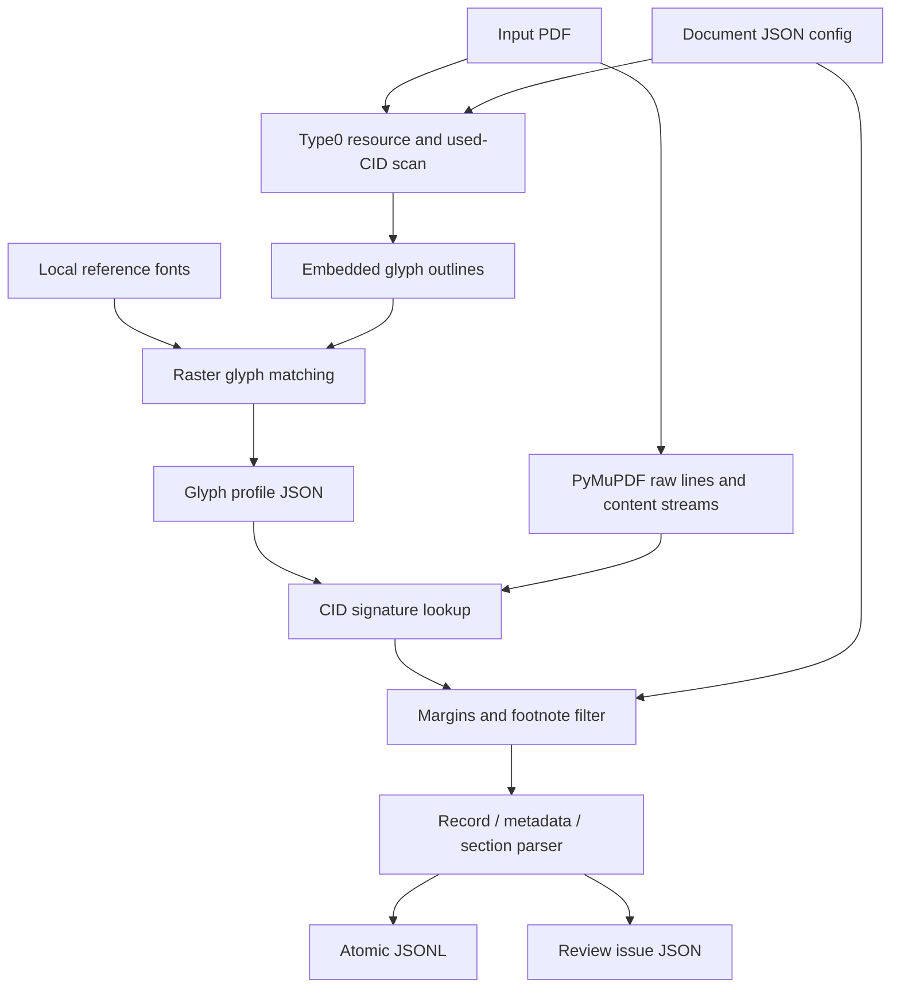

# Vietnamica Alignment

Deterministic extraction of structured Vietnamese inscription records from PDFs with unreliable embedded-font mappings.

[🇻🇳 Tiếng Việt](README.vi.md)

## Overview

Vietnamica Alignment converts a configured inscription PDF into UTF-8 JSONL. It targets PDFs where library-extracted text is unreliable for embedded subset fonts: a page’s character code can be a CID, not the intended Unicode character.

The project builds a glyph profile from embedded outlines and local Unicode reference fonts. Extraction recreates an outline signature for a CID and uses that profile to recover a Unicode character; it then filters lines and parses them into inscription records. The main inputs are a PDF, JSON config, and glyph profile. The main output is JSONL grouped by inscription face and section. OCR is not used.

## Motivation and problem statement

PDF text is not necessarily Unicode text. In a composite Type0 font with `Identity-H` or `Identity-V`, a two-byte code is a CID (Character Identifier): it addresses a glyph in that font, rather than automatically identifying a Unicode code point. `/ToUnicode` or a PDF library’s extracted character can therefore be missing or unreliable for a subset font.

For its supported font forms, this repository:

1. Reads Type0 resources and CIDs shown in PDF content streams.
2. Obtains the embedded CFF/CID or TrueType/OpenType glyph outline.
3. Converts the outline to deterministic SVG path commands and hashes them with SHA-256, truncated to 24 hexadecimal characters (the glyph signature).
4. While building a profile, rasterizes embedded and matching-reference-font outlines; it assigns the lowest sum-of-absolute grayscale-pixel-difference candidate’s code point.
5. During extraction, performs exact signature lookup rather than repeating raster matching or trusting raw extracted Unicode.

Reference font selection normalizes PDF family/style names and matches name-table family records in `fonts/reference/`. This is an implementation rule, not proof of semantic uniqueness: identical-looking glyphs or a poor reference font can yield an ambiguous or incorrect mapping. Review generated profiles for research or corpus-quality use.

## Goals

- Extract ordered PDF text without changing the source PDF.
- Recover Unicode for supported embedded CID glyphs from a stored outline-signature profile.
- Keep document-specific parsing rules in JSON.
- Write deterministic, validated UTF-8 JSONL and review artifacts.
- Retain recoverable structural problems for manual review while continuing with later valid records.
- Supply font/glyph inspection helpers.

## Non-goals and current limitations

> [!WARNING]
> This is not a general PDF-to-Unicode system.

- OCR, image-only PDFs, handwriting recognition, and language-model correction are not implemented.
- The profile builder accepts only Type0 `cff`, `cid`, `ttf`, or `otf` resources with `Identity-H`/`Identity-V` and two-byte CIDs. Type1, simple fonts, and other CMaps are excluded.
- A present Type0 TrueType/OpenType `CIDToGIDMap` is unsupported; only the identity/default case is mapped.
- Content-stream parsing recognizes particular `Tf`/`Tj`/`TJ` patterns. Other valid operator layouts are implementation-dependent.
- There is no raster-match score threshold, confidence score, or automatic ambiguity resolution beyond the lowest score.
- Profiles depend on exact outlines and must be rebuilt when relevant embedded outlines change.
- `encoded_fonts` filters the profile builder. It is passed to `GlyphDecoder`, but the current decode path does not call `_is_encoded()` and attempts supported Type0 outlines it encounters.
- Metadata/section parsing is heading- and regex-driven, not general layout understanding.
- `export_searchable_pdf()` is only a library function; no CLI is supplied. It references missing `tools/extract_ttc_face.py` in an error message.
- `tests/test_filter_unsupported_characters.py` references a missing `tools/filter_unsupported_characters.py`; that utility is not available in this checkout.

## Features

### Core

- JSON config/profile validation and config-relative paths.
- Used-CID-only profile building for eligible Type0 resources.
- CFF/CID and identity-mapped Type0 TrueType/OpenType outline handling.
- Signature-based CID-to-Unicode recovery.
- NFC, unsafe-character, and whitespace cleanup.
- Parsing of numbered records, metadata, face markers, and configured sections.

### Performance implementation

- Used CID selection and reference-cmap candidate de-duplication.
- Cached selected reference fonts and rasterized reference glyphs.
- Cached decoder maps/signatures per embedded-font xref.
- Atomic JSONL writes: fsynced temporary file, then replacement.

### Validation and debugging

- Aggregate statistics plus profile-miss, fallback, and unresolved-character logs.
- JSON issue items for malformed records, count/sequence violations, and parser warnings.
- Deterministic JSONL requiring `noi_dung` as the final field and rejecting unsafe Unicode.
- PDF-font inventory, reference-font inspection, and hard-coded manual glyph rendering tools.

### Commands

| Command | Purpose |
| --- | --- |
| `python extract_pdf.py --config CONFIG` | Extract JSONL and issue JSON. |
| `python tools/build_glyph_profiles.py --pdf PDF --output OUTPUT [--config CONFIG ...]` | Build a glyph profile. |
| `python tools/get_fonts.py` | Inventory all PDFs in repository `input/`. |
| `python tools/get_ref_font.py` | Inspect reference fonts at its hard-coded repository path. |
| `python tools/test_font.py` | Render hard-coded review code points to `unsupported_fonts/`. |

Run from the repository root. The last three tools have no CLI arguments in the current codebase.

## Architecture



| Component | Responsibility |
| --- | --- |
| `extract_pdf.py` | CLI orchestration and artifact writing. |
| `extraction/config.py` | Config and profile loading/validation. |
| `extraction/glyphs.py` | Outline extraction, SVG commands, signatures. |
| `tools/build_glyph_profiles.py` | Used-CID scan, reference selection, raster matching, profile output. |
| `extraction/decoder.py` | Font-resource disambiguation, CID decoding, line filtering. |
| `extraction/records.py` | Record, metadata, section, marker, and issue parsing. |
| `extraction/jsonl.py` | Layout cleanup, validation, serialization, atomic writes. |
| `extraction/service.py` | Library workflow orchestration. |
| `extraction/searchable_pdf.py` | Optional searchable-PDF library export. |

## Requirements and installation

`pyproject.toml` requires Python 3.10+, `fonttools==4.65.0`, `pillow>=12.3.0`, and `pymupdf==1.28.2`; `.python-version` is 3.10 and `uv.lock` is present.

```bash
uv sync --frozen
```

Profile building also requires appropriate local files in `fonts/reference/`. Configured PDFs and profiles must exist before extraction. `input/`, `output/`, and `data/` are ignored local-artifact directories, not tracked inputs.

## Quick start

From the repository root:

1. Add a document config in `configs/`.
2. Ensure suitable reference fonts are under `fonts/reference/`.
3. Build the document profile.
4. Extract and review issue/log output.

```bash
uv run python tools/build_glyph_profiles.py \
  --pdf input/your-document.pdf \
  --output data/glyph_profiles/your-document.json \
  --config configs/your-document.json

uv run python extract_pdf.py \
  --config configs/your-document.json \
  --pretty-output output/your-document.pretty.json
```

The builder does not create the parent directory of `--output`; create it first. The extraction CLI does create output parents.

## Configuration

`input_pdf`, `output_jsonl`, and `glyph_profile` resolve relative to the config file. Builder `--pdf`/`--output` and `fonts/reference/` resolve from the process working directory.

```json
{
  "input_pdf": "../input/document.pdf",
  "output_jsonl": "../output/document.jsonl",
  "glyph_profile": "../data/glyph_profiles/document.json",
  "title_pattern": "^VĂN BIA SỐ\\s+(?P<number>\\d+)\\s*$",
  "content_start": "Nguyên văn chữ Hán Nôm",
  "content_sections": ["Nguyên văn chữ Hán Nôm", "Phiên âm Hán Việt"],
  "marker_pattern": "^\\s*<\\s*(?P<id>\\d+)\\s*>?\\s*(?P<rest>.*)$",
  "encoded_fonts": ["NomNaTong"],
  "page_margins": {"top": 40, "bottom": 45},
  "metadata": [{"label":"Tên bia","field":"ten_bia","type":"string","required":true}]
}
```

| Field | Required | Behavior |
| --- | --- | --- |
| `input_pdf`, `output_jsonl`, `glyph_profile` | Yes | Non-blank config-relative paths. |
| `metadata` | Yes | Non-empty; fields unique and not `so_van_bia`/`noi_dung`. |
| `metadata[].label`, `field` | Yes | Non-blank strings; labels tolerate implemented accent/`Kí`/`Ký`/`Ð` variants. |
| `metadata[].type` / `required` | No | `string` (default) or `identifiers`; boolean default `true`. Identifiers come from `<digits>`. |
| `title_pattern` | No | Regex with named `number`. |
| `content_start`, `content_sections` | No | Content-start heading and allowed section headings. |
| `marker_pattern` | No | Regex with named `id`; optional named `rest` is inline content. |
| `encoded_fonts` | No | Builder font-selection tokens; see limitation above. |
| `page_margins` | No | Non-negative `top`/`bottom`, default 40/45 points; lines crossing either region are dropped. |
| `footnote_filter` | No | Requires `start_pattern`; optional positive `max_font_size`. First matching line and every following line on that page are dropped. |
| `expected_record_count` | No | Positive integer; mismatch is a global issue. |
| `require_consecutive_numbers` | No | Boolean default `true`; violation is a global issue. |

`title_pattern` and `marker_pattern` are compiled at load time and must define `(?P<number>...)` and `(?P<id>...)`, respectively.

## Glyph profile

The loader accepts a non-empty signature-keyed JSON object. It requires typed fields below and verifies `char == chr(codepoint)` and `unicode == U+<codepoint>`.

```json
{
  "0123456789abcdef01234567": {
    "glyph": "cid00168",
    "codepoint": 26481,
    "unicode": "U+6771",
    "char": "東"
  }
}
```

The builder scans eligible `Identity-H`/`Identity-V` content for used two-byte CIDs, finds a reference font, and profiles only those glyphs. Empty outlines map to U+0020; other outlines receive the lowest-scoring reference cmap code point. Extraction rebuilds the signature and retrieves `char`; a missing signature becomes a logged fallback/unresolved case.

Treat profiles as generated evidence, not a universal character map. Preserve the PDF, config, reference-font set, profile, command, and review outputs together for reproducibility.

## Running extraction

```bash
uv run python extract_pdf.py --config configs/your-document.json
```

| Option | Effect |
| --- | --- |
| `--config PATH` | Required config. |
| `--pretty-output PATH` | Also write indented review JSON. |
| `--issues-output PATH` | Override issue location; default `<stem>_invalid.json` beside JSONL. |
| `--keep-flagged-records` | Keep parser-warned records in JSONL. Malformed records are never emitted. |
| `--content-layout preserve\|space\|no-space` | Keep, space-join, or remove `van_ban` line breaks. |
| `--strip-literal-backslashes` | Remove literal backslashes only from `van_ban`, not JSON escaping. |

The CLI always writes issue JSON. By default it excludes records whose number appears in a parser-warning issue; it prints parser warnings to stderr and decode statistics/events through logging.

## Output and review

Each primary-output line is compact JSON; configured metadata is followed by required-final `noi_dung`.

```json
{"so_van_bia":1,"ten_bia":"[Vô đề]","ky_hieu_vnchn":["12305"],"noi_dung":[{"ky_hieu":"12305","chuyen_muc":[{"tieu_de":"Nguyên văn chữ Hán Nôm","van_ban":"…"}]}]}
```

| Field | Meaning |
| --- | --- |
| `so_van_bia` | Number captured by `title_pattern`. |
| Configured metadata | Strings, or identifier arrays for `identifiers`. |
| `noi_dung` | Encounter/insertion-order faces; `ky_hieu` may be `null` for unmarked content. |
| `chuyen_muc` | Objects containing section `tieu_de` and newline-joined `van_ban`. |

Issue items include `so_van_bia`, `trang`, `loi`, and `canh_bao`; they contain `van_bia` for parsed-but-warned records or `du_lieu_nguon` for malformed records. Warnings cover pre-metadata lines, unknown/unmarked markers, and declared markers without assigned content. Missing content-start heading or required metadata makes only that record malformed, so later ranges still parse.

## Reproducibility and verification

```bash
uv run python -m unittest discover -s tests -v
```

This checkout’s full suite is currently not green:

- The missing `tools/filter_unsupported_characters.py` prevents its test module from importing.
- `configs/tap_1.json` expects 100 records, but configured `input/tap1-short-21-page.pdf` yields one title range; the integration test fails with `Expected 100 records, found 1`.

Generated/local PDFs, profiles, and outputs in ignored directories are inspectable here but not version-controlled guarantees. Record exact inputs and compare `serialize_jsonl()` output or JSONL bytes after reviewing profile and issue artifacts.

## Project layout

| Path | Role |
| --- | --- |
| `configs/tap_1.json` | Example per-document config. |
| `extract_pdf.py` | Main extraction CLI and public re-exports. |
| `extraction/` | Config, glyph, decoding, parsing, output, searchable-PDF modules. |
| `tools/build_glyph_profiles.py` | Profile builder. |
| `tools/get_fonts.py`, `tools/get_ref_font.py`, `tools/test_font.py` | Inspection/review helpers. |
| `fonts/reference/` | Builder reference fonts. |
| `tests/` | Unit and sample integration tests. |
| `input/`, `data/`, `output/` | Ignored local inputs, profiles, and results. |
| `unsupported_fonts/` | Committed manual-review PNGs. |

## Extending

For a new document, first add a config, appropriate headings/patterns, and a separate profile; then inspect logs and issues. Do not reuse a profile solely because font names look alike—the lookup uses exact outline signatures.

Code changes are needed for new PDF font/CMap cases, alternate text-show syntax, non-identity `CIDToGIDMap`, different matching/validation policy, or a different output model. Keep shared outline behavior in `extraction/glyphs.py` so builder and decoder remain compatible, and add tests for both profile interpretation and extraction fallback behavior.
