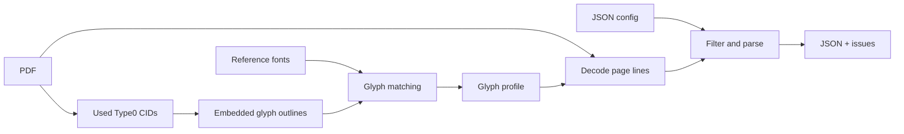

# Vietnamica Alignment

Extract structured Vietnamese inscription data from PDFs whose embedded-font text mapping is unreliable.

[](pyproject.toml)
[](pyproject.toml)
[](#output)

[🇻🇳 Tiếng Việt](README.vi.md)

> `PDF text extraction` · `Type0 CID decoding` · `glyph-outline profiles` · `JSON output`

## What it does

Some PDFs store visible text as character identifiers (CIDs) in embedded subset fonts, rather than reliable Unicode characters. Vietnamica Alignment recovers supported glyphs by matching their outlines to a generated glyph profile, then turns the decoded text into structured JSON records.

It takes a PDF, a document config, and a glyph profile. It writes a UTF-8 JSON array of inscription records plus a separate issue file for review. It does not use OCR or modify the source PDF.

## Quick start

Requirements: Python 3.11+, [uv](https://docs.astral.sh/uv/), the project dependencies, and suitable reference fonts in `fonts/reference/`.

```bash
uv sync --frozen
```

Create a config for the document, build its glyph profile, then extract:

```bash
uv run python tools/build_glyph_profiles.py \
  --pdf input/your-document.pdf \
  --output data/glyph_profiles/your-document.json \
  --config configs/your-document.json

uv run python extract_pdf.py \
  --config configs/your-document.json \
  --pretty-output output/your-document.pretty.json
```

Run commands from the repository root. The profile builder does not create the parent directory of `--output`; create it first. The extraction command creates parents for its output files.

## PDF image extractor UI

This repository also includes a completely local tool for extracting standalone
embedded images from mixed text/image PDFs. It uses PyMuPDF XObjects directly:
it does **not** screenshot a PDF page where an embedded image is available.

Install the updated local dependencies, then run:

```bash
uv sync
uv run python app.py
```

Or, with an existing Python 3.11+ environment:

```bash
pip install -e .
python app.py
```

Open the localhost address printed by Gradio and upload one PDF. The detector
examines every page's image XObjects, text blocks, drawings, image display
rectangles, and coverage. Pages without a meaningful dominant image (such as
text-only pages, logos, icons, or small decorative images) are omitted from the
main selector. Its confidence and the raw page analysis are available in the
**PDF Analysis** panel.

The default is an unconstrained **Free Crop**. **Use DCI 4K Frame
(2160×4096)** switches to a locked portrait frame. The displayed editor is a
performance thumbnail, but its crop coordinates are stored in original-image
pixels and saved files are regenerated from the full-resolution XObject.

After moving or resizing the frame, releasing the pointer updates the pending
crop. Use **Apply to live preview** to commit it, then **Save Applied Final**;
or use **Apply & Save Final** to do both together.

`2160×4096` is a maximum, not an automatic output size. A crop larger than that
is downscaled with Lanczos; a smaller crop is retained at its native resolution.
The application never upscales. All saved images are JPEGs, and both originals
and finals are constrained to a 4096-pixel maximum longest side. Files are
named sequentially in PDF appearance order: `<book_name>.001.jpg`,
`<book_name>.002.jpg`, and so on.

Saving writes only local files in this structure:

```text
output/
  pdf_name/
    page_003/
      original/book_name.001.jpg
      final/book_name.001.jpg
      metadata.json
```

**Save All Detected Images** uses each page's manual crop if one was applied,
otherwise its automatic centered crop.

To open and automatically scan one PDF from the repository's `input/` folder,
pass its path as the positional argument:

```bash
uv run python app.py input/your-document.pdf
```

The regular upload control remains available if no argument is provided.

## Optional character detection

`character_detection/` is an inference-only extraction of the AutoHDR paper's
character detector. It detects character boxes and orders them spatially; it
does **not** recognize character identities. Its algorithm is kept isolated
from the normal image pipeline.

The integration adapter is
[`pdf_image_extractor/character_annotations.py`](pdf_image_extractor/character_annotations.py).
The batch runner writes one `character_annotations.json` collection in each
PDF output folder. It contains image names, collection-relative image paths,
dimensions, and the character boxes for every saved final image; source images
and their extraction/crop metadata are not changed.

The ML runtime is optional. Use Python 3.12 for the most predictable local
Torch ecosystem, install the extra, place a platform-compatible released
AutoHDR executable at `character_detection/models/det_model`, then run:

```bash
uv sync --extra character-detection
uv run python tools/detect_characters.py \
  output/book/page_003/final/book.001.jpg
```

The detector executable is intentionally ignored by Git. For CUDA or other
accelerators, install the appropriate Torch build from the official PyTorch
selector, then pass `--device cuda` (or another supported device) to the tool.

### Kaggle (Linux x86_64)

The released executable currently included in `character_detection/models/` is
for Linux x86_64, which matches a standard Kaggle notebook. After cloning the
repository (and copying the ignored model file into that path), enable Internet
in the notebook if dependencies are not cached, then run:

```bash
!python tools/run_kaggle_character_detection.py \
  --output-dir output/tap1-short-21-page
```

This writes `output/tap1-short-21-page/character_annotations.json`. Use
`--image` one or more times only when a partial run is wanted. Add `--device
cuda` when the Kaggle accelerator is enabled and its Torch build supports CUDA;
use `--skip-install` when the optional dependencies were already installed in
the notebook.

## Character annotation editor

After the detector writes a PDF-level `character_annotations.json`, use the
separate local editor to correct its character-level boxes. It works without
the ML model or its optional dependencies:

```bash
uv run python tools/annotate_characters.py \
  output/tap1-short-21-page/character_annotations.json
```

The editor displays one final image at a time and has **Previous image** and
**Next image** controls. Select and drag a box to move it, drag a corner to
resize, or use **Add box** and **Delete selected**. Changes remain in memory
while navigating. **Save current image** writes only the image currently shown;
**Save all annotations** writes every pending edit in the collection. Both
preserve other metadata and regenerate `corners` from every saved `bbox_xyxy`.

## How it works



1. The profile builder scans eligible Type0 PDF resources and profiles only CIDs actually used by the document.
2. It converts outlines to SVG path commands, derives a short SHA-256 signature, and selects a Unicode candidate from a matching local reference font by raster comparison.
3. The extractor recreates each supported CID outline signature and looks up its Unicode character in the profile.
4. It removes configured page furniture/footnotes and parses titles, metadata, markers, and sections into records.

## Configuration

Use [`configs/tap_1.json`](configs/tap_1.json) as a schema example. `input_pdf`, `output_json`, and `glyph_profile` are resolved relative to the config file.

```json
{
  "input_pdf": "../input/document.pdf",
  "output_json": "../output/document.json",
  "glyph_profile": "../data/glyph_profiles/document.json",
  "title_pattern": "^VĂN BIA SỐ\\s+(?P<number>\\d+)\\s*$",
  "content_start": "Nguyên văn chữ Hán Nôm",
  "content_sections": ["Nguyên văn chữ Hán Nôm", "Phiên âm Hán Việt"],
  "marker_pattern": "^\\s*<\\s*(?P<id>\\d+)\\s*>?\\s*(?P<rest>.*)$",
  "encoded_fonts": ["NomNaTong"],
  "metadata": [
    {"label": "Tên bia", "field": "ten_bia", "type": "string", "required": true}
  ]
}
```

| Field | Purpose |
| --- | --- |
| `input_pdf`, `output_json`, `glyph_profile` | Source PDF, generated profile, and output path. |
| `title_pattern` | Record-title regex; must include named group `number`. |
| `metadata` | Required metadata labels and output fields. `identifiers` parses `<digits>` values. |
| `content_start`, `content_sections` | Heading that begins content and the permitted section headings. |
| `marker_pattern` | Face-marker regex; must include named group `id`. |
| `page_margins`, `footnote_filter` | Optional line filtering. |
| `expected_record_count`, `require_consecutive_numbers` | Optional corpus-level checks reported as issues. |

`encoded_fonts` selects fonts when building a profile. In the current decoder implementation it is passed through but not used to gate decoding, so mixed-font PDFs need careful review.

## Output

The primary output is one compact JSON array. Every record ends with `noi_dung`.

```json
[
  {
    "so_van_bia": 1,
    "ten_bia": "[Vô đề]",
    "ky_hieu_vnchn": ["12305"],
    "noi_dung": [
      {
        "ky_hieu": "12305",
        "chuyen_muc": [
          {"tieu_de": "Nguyên văn chữ Hán Nôm", "van_ban": "…"}
        ]
      }
    ]
  }
]
```

The CLI also writes `<output-stem>_invalid.json` by default. It contains malformed records, parser warnings, and global count/sequence violations. By default, records with parser warnings are excluded from the primary output; use `--keep-flagged-records` to retain them.

### Extraction options

| Option | Description |
| --- | --- |
| `--config PATH` | Required document config. |
| `--pretty-output PATH` | Write an indented copy for manual review. |
| `--issues-output PATH` | Override the default issue-file path. |
| `--keep-flagged-records` | Keep parser-warned records in primary JSON. |
| `--content-layout preserve\|space\|no-space` | Keep, space-join, or remove `van_ban` line breaks. |
| `--strip-literal-backslashes` | Remove literal backslashes from `van_ban` only. |

## Repository layout

| Path | Description |
| --- | --- |
| `extract_pdf.py` | Stable CLI for text extraction. |
| `app.py` | Stable launcher for the local Gradio image UI. |
| `configs/` | Per-document parser and filter rules. |
| `extraction/` | Text pipeline: configuration, glyph decoding, parsing, JSON output, and searchable-PDF support. |
| `pdf_image_extractor/detection.py` | Embedded XObject detection and original-image loading. |
| `pdf_image_extractor/processing.py` | Pixel-space crop and no-upscale resize logic. |
| `pdf_image_extractor/storage.py` | JPEG naming, output layout, and metadata persistence. |
| `pdf_image_extractor/service.py` | UI-independent image workflow operations. |
| `pdf_image_extractor/gradio_ui.py` | Gradio presentation layer and crop-editor integration. |
| `pdf_image_extractor/core.py` | Backward-compatible imports for older callers. |
| `character_detection/` | Optional AutoHDR-derived character-box detector; algorithm remains isolated. |
| `tools/detect_characters.py` | Optional local detector CLI and JSON-sidecar writer. |
| OCR / recognition | Not used or loaded; image files are numbered by PDF appearance order. |
| `tools/build_glyph_profiles.py` | Glyph-profile builder. |
| `tools/get_fonts.py` | PDF font inventory. |
| `tools/get_ref_font.py` | Reference-font metadata inspector. |
| `tools/test_font.py` | Hard-coded glyph rendering helper. |
| `fonts/reference/` | Local Unicode reference fonts. |
| `tests/` | Unit and integration tests. |

## Limitations

- Supported profile building is limited to Type0 `cff`, `cid`, `ttf`, and `otf` resources with `Identity-H`/`Identity-V` two-byte CIDs.
- Type1/simple fonts, unsupported CMaps, and non-identity Type0 `CIDToGIDMap` cases are not decoded.
- The raster matcher has no confidence threshold; profile output should be reviewed.
- Content-stream recognition handles specific `Tf`/`Tj`/`TJ` patterns, not every valid PDF construction.
- `extraction.searchable_pdf.export_searchable_pdf()` is a library API, not a CLI command.

## Verify

```bash
uv run python -m unittest discover -s tests -v
```

The unit suite covers text parsing, JSON output, unsupported-character review,
and image crop/resize limits. The sample integration test is intentionally
skipped because the checked-in config points at an abbreviated source fixture.

## Extending

For a new collection, add a config and separate glyph profile before changing code. Extend `extraction/glyphs.py` and add focused tests when supporting a new font/CMap or text-show form, so profile building and decoding remain compatible.
