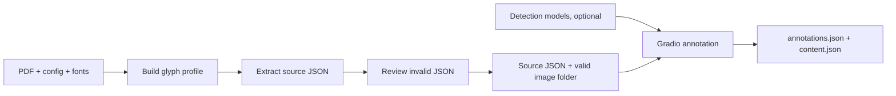

# SinoNom Annotation

Tools for extracting structured Vietnamese inscription content from PDF files and annotating Hán/Nôm characters in images.

[](requirements.txt)
[](gradio/requirements.txt)
[](#outputs)

[Tiếng Việt](README.vi.md)

## Components

| Component | Purpose |
| --- | --- |
| `text_extraction/` | Decodes embedded Type0 CID glyphs and converts PDF content into structured JSON. |
| `text_detection/` | Detects intact and damaged character boxes and proposes an initial reading order. It does not recognize characters. |
| `gradio/` | Seven-step interface for content verification, box editing, status, reading order, crop and review. |

The Gradio app consumes extraction JSON. It does not extract text directly from a PDF.

## Processing flow

Before starting, prepare:

- one source PDF;
- one document config based on [`configs/tap_1.json`](configs/tap_1.json);
- a flat image folder whose filename stems match the inscription `ky_hieu` values;
- matching reference fonts in `fonts/`;
- detection checkpoints and the OCR executable only when automatic box detection is needed.



| Step | Required input | Result |
| --- | --- | --- |
| Build glyph profile | PDF, document config and reference fonts | CID-to-Unicode glyph profile. |
| Extract text | PDF, config and glyph profile | Source JSON plus `_invalid.json` for manual review. |
| Prepare images | Flat image folder and valid `ky_hieu` values | Images with invalid/missing source records removed. |
| Run Gradio | Valid image folder and extracted source JSON | Content verification and character annotation workflow. |
| Automatic detection | The three model assets in their default folders | Initial intact/damaged bounding boxes and reading order. |
| Save results | Verified content and completed Review steps | Downloadable `content.json` and `annotations.json`. |

## Installation

The complete runtime targets Linux x86_64, Python 3.11 and CUDA 12.1:

```bash
python -m pip install -r requirements.txt
```

This installs PDF extraction, Gradio, PyTorch, MMCV and MMDetection. The Torch/MMCV versions are intentionally pinned together. A clean environment is recommended.

For the UI without detection models:

```bash
python -m pip install -r gradio/requirements.txt
```

## PDF text extraction

Extraction is config-driven. [`configs/tap_1.json`](configs/tap_1.json) is the reference configuration and defines:

- source PDF, glyph profile and output paths;
- page margins and footnote filtering;
- record titles and metadata fields;
- face-marker syntax;
- allowed content sections;
- Gradio image input and annotation output directories.

### Configuration fields

All relative paths are resolved from the directory containing the config file.

| Field | Input/output | Meaning and when it is used |
| --- | --- | --- |
| `input_pdf_path` | Input | PDF processed by both glyph-profile generation and text extraction. Change it when processing another PDF. |
| `paths.output_json` | Output, then input | Destination of the extracted inscription JSON. After extraction, Gradio uses the same file as its source content unless `--source-json` overrides it. |
| `paths.glyph_profile` | Intermediate output/input | Glyph profile generated by `text_extraction.glyph_profile` and read by `text_extraction.main` to convert embedded CIDs into Unicode. Use a separate profile for each PDF/font set. |
| `gradio.image_dir` | Input | Flat folder of images displayed and annotated by Gradio. Each filename stem must equal a `ky_hieu` found in `paths.output_json`. Override with `--image-dir` when necessary. |
| `gradio.output_dir` | Output | Folder where **Save image** writes per-image annotation JSON and internal state. Override with `--output-dir` when necessary. |
| `encoded_fonts` | Input mapping, auto-refreshed | Maps embedded PDF font names to local reference-font files. Font discovery updates this mapping before profile generation and extraction. |
| `page_filter.margins.top` | Extraction rule | Height removed from the top of every PDF page before record parsing. |
| `page_filter.margins.bottom` | Extraction rule | Height removed from the bottom of every PDF page before record parsing. |
| `page_filter.footnotes` | Extraction rule | Footnote detection using `start_pattern` and `max_font_size`; use `null` to disable footnote filtering. |
| `records.title_pattern` | Parsing rule | Regular expression identifying the start of an inscription record. It must provide the named group `number`. |
| `records.metadata` | Parsing rule | Declares metadata headings, output field names, value type and whether each field is required. |
| `records.content.start_heading` | Parsing rule | Heading that marks the start of content sections. |
| `records.content.section_headings` | Parsing rule | Exact content section names accepted by the extractor. These also determine which sections can be shown by the Gradio content editor. |
| `records.face_marker_pattern` | Parsing rule | Regular expression mapping content to an inscription face/image. It must provide the named group `id`, which becomes `ky_hieu`. |
| `records.require_consecutive_numbers` | Validation rule | When `true`, non-consecutive or duplicate inscription numbers are reported in `_invalid.json`. |

Build the glyph profile, then extract the PDF:

```bash
python -m text_extraction.glyph_profile \
  --config configs/tap_1.json

python -m text_extraction.main \
  --config configs/tap_1.json
```

Both commands discover compatible embedded/reference fonts and refresh `encoded_fonts`. Paths inside a config are resolved relative to that config file.

The primary output is a UTF-8 JSON array:

```json
[
  {
    "so_van_bia": 1,
    "ten_bia": "[Vô đề]",
    "ky_hieu_vnchn": ["12305"],
    "noi_dung": [
      {
        "ky_hieu": "12305",
        "chuyen_muc": [
          {
            "tieu_de": "Nguyên văn chữ Hán Nôm",
            "van_ban": "永寺樂"
          }
        ]
      }
    ]
  }
]
```

Extraction also creates `<output-stem>_invalid.json` containing malformed records, parser warnings and sequence errors. Records flagged for review are excluded from the primary JSON.

## Detection models

Place external model assets at the default paths:

```text
text_detection/models/
├── ckpts/
│   ├── damage_detect.py
│   └── damage_detect.pth
└── dists/
    └── det_model/
        └── det_model
```

Make the OCR executable runnable on Linux:

```bash
chmod +x text_detection/models/dists/det_model/det_model
```

With this layout, Gradio needs no model-path arguments. The packaged OCR subprocess is quiet by default, including PyInstaller `PyiFrozenFinder` output. Use `--show-detection-logs` only for startup debugging.

The config and checkpoint must come from the same AutoHDR release. The OCR executable must match the host operating system and architecture. The pinned runtime uses Torch 2.1.0/cu121, MMCV 2.1.0, MMEngine 0.10.5 and MMDetection 3.3.0; MMDetection 3.3.0 requires MMCV below 2.2.0. Use full `mmcv`, not `mmcv-lite`, because detection requires compiled operations.

Detection performs four operations:

1. locate ordinary character boxes with the OCR detector;
2. locate damaged-character boxes with DINO;
3. remove an ordinary box when its IoU with a damaged box is at least `0.5`;
4. fuse the remaining boxes and propose a layout-aware reading order.

Run detection for one image independently:

```bash
python -m text_detection path/to/image.jpg \
  --output output/detection.json
```

The detection result uses stable one-based IDs and original-image `xyxy` coordinates:

```json
{
  "image": "12305.jpg",
  "bounding_boxes": {
    "1": {"bbox": [120, 450, 180, 520], "status": "damaged"},
    "2": {"bbox": [120, 350, 180, 420], "status": "intact"}
  },
  "reading_order": [2, 1]
}
```

For Python integrations, `text_detection.run_stage1()` returns a `Stage1Result` with `ocr_boxes`, `damage_boxes`, `normal_boxes`, `fused_boxes` and `ordered_boxes`. `iter_stage1()` additionally emits progress phases for model loading, preprocessing, detection, fusion and reading order.

If an external DINO config imports unavailable dataset-only modules such as `mmdet.datasets.fssj` or `mmdet.datasets.hdr`, remove those dataset imports for inference while preserving custom model and transform imports.

## Gradio annotation app

Image files must be directly inside one flat folder. Each filename stem must match one `ky_hieu` in the source JSON and must be unique.

When CLI paths are omitted, Gradio reads them from the document config:

```json
{
  "paths": {
    "output_json": "../output/tap_1.json",
    "glyph_profile": "../data/glyph_profiles/tap1-short_1.json"
  },
  "gradio": {
    "image_dir": "../data/images",
    "output_dir": "../data/annotations"
  }
}
```

`paths.output_json` becomes the source JSON. `gradio.image_dir` and `gradio.output_dir` provide the image and annotation folders. Relative paths are resolved from the config file location.

In this example:

- `../output/tap_1.json` is first created by PDF extraction, then read by Gradio as source content;
- `../data/glyph_profiles/tap1-short_1.json` stores the CID-to-Unicode profile used during extraction;
- `../data/images` contains the images shown in the annotation interface;
- `../data/annotations` receives per-image annotation files and internal Save-all state.

Run entirely from the default `configs/tap_1.json`:

```bash
python gradio/app.py
```

Use another config or override any path individually. Explicit CLI parameters always take priority:

```bash
python gradio/app.py \
  --config /path/to/config.json \
  --image-dir /override/images \
  --output-dir /override/annotations
```

The Content screen exposes only these existing sections from the selected inscription face:

| Source section | UI label |
| --- | --- |
| `Nguyên văn chữ Hán Nôm` | Original Hán/Nôm text |
| `Phiên âm Hán Việt` | Sino-Vietnamese transcription |
| `Dịch nghĩa` | Translation |
| `Toát yếu` | Summary |
| `Chú thích` | Notes |

The original Hán/Nôm section is the character-annotation source. Missing sections are not invented, and metadata or content belonging to another face cannot be edited from this screen.

```bash
python gradio/app.py \
  --image-dir /path/to/images \
  --source-json /path/to/extracted-source.json \
  --output-dir /path/to/annotations
```

To review the UI or annotate manually without loading detection models:

```bash
python gradio/app.py \
  --image-dir /path/to/images \
  --source-json /path/to/extracted-source.json \
  --output-dir /path/to/annotations \
  --skip-detection
```

Open `http://127.0.0.1:7860`. For a remote environment:

```text
--server-name 0.0.0.0 --share
```

### Workflow

1. **Image** — select an image from the configured folder.
2. **Content** — verify and save the five configured sections: original Hán/Nôm, Sino-Vietnamese transcription, translation, summary and notes.
3. **Bounding Boxes** — detect, add, move, resize or delete boxes with stable IDs.
4. **Status** — mark every character as `intact` or `damaged`.
5. **Reading Order** — reorder stable box IDs without changing their character mapping.
6. **Crop** — set an independent rectangular crop using original-image coordinates.
7. **Review** — inspect the final table/text/JSON and save the image object.

The Python state is authoritative. JavaScript only reports UI actions. Any content or box change invalidates dependent alignment and reading-order confirmation. Annotation can continue only when normalized character count equals box count.

Identity and order are deliberately separate:

```text
box_id = identity
bbox = location
status = condition
annotations[box_id] = character
reading_order = sequence of box IDs
```

Deleting a box removes its annotation and order entry without renumbering other boxes. Reordering changes only `reading_order`. Text normalization uses NFC, removes whitespace and Unicode punctuation, and counts grapheme clusters so combining marks and variation selectors are not separate characters.

The UI serves NomNaTong, DengXian and PMingLiU locally, with PMingLiU-ExtB available for extended characters. Font selection changes rendering only and never changes stored text or alignment.

### Saving

- **Save content** updates the source JSON and adds/updates that image in the internal content registry. It does not download a file.
- **Save image** on Review commits bounding boxes, annotations, reading order and crop for that image.
- **Save all** downloads:
  - `annotations.json` for images committed with **Save image**;
  - `content.json` for images committed with **Save content**.

Drafts are never included until their corresponding Save action is used.

## Outputs

```text
annotations/
├── 12305.json          # boxes, statuses, annotations, reading order and crop
└── .state/
    ├── 12305.json      # stable-ID and validation metadata
    └── content.json    # internal Save-all content registry
```

All JSON is written as UTF-8 with readable Unicode. Per-image annotation writes are atomic.

Crop is stored as `top_left`, `top_right`, `bottom_right` and `bottom_left` in original-image coordinates. If no crop is edited, the saved crop covers the full image. Source updates use an in-process lock and baseline comparison; the application is intended to run as one server process, and concurrent edits of the same image should be avoided.

## Repository layout

```text
configs/                 Document-specific extraction rules
fonts/                   Unicode reference fonts and Hán/Nôm UI fonts
text_extraction/         PDF decoding, glyph profiles and record parsing
text_detection/          OCR/damage localization and reading-order proposal
gradio/                  Annotation application and UI assets
requirements.txt         Complete Python 3.11/CUDA 12.1 runtime
```
