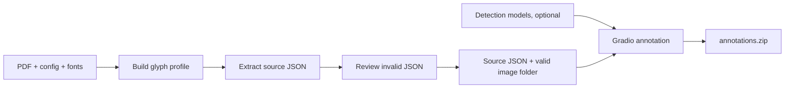

# SinoNom Annotation

<p align="center">
  <strong>Tools for extracting structured Vietnamese inscription content from PDF files and annotating Hán/Nôm characters in images.</strong>
</p>

<p align="center">
  <a href="requirements.txt">
    
  </a>
  <a href="gradio/requirements.txt">
    
  </a>
</p>

---

## 📑 Table of Contents

- [SinoNom Annotation](#sinonom-annotation)
  - [📑 Table of Contents](#-table-of-contents)
  - [🧩 Components](#-components)
  - [🔄 Processing Flow](#-processing-flow)
  - [⚙️ Installation](#️-installation)
  - [📄 PDF Text Extraction](#-pdf-text-extraction)
    - [Configuration](#configuration)
      - [Preparing Reference Fonts](#preparing-reference-fonts)
      - [Config file](#config-file)
      - [Input and output paths](#input-and-output-paths)
      - [Font decoding](#font-decoding)
      - [Page filtering](#page-filtering)
      - [Inscription parsing](#inscription-parsing)
  - [🔍 Detection Models](#-detection-models)
  - [🖥️ Gradio Annotation App](#️-gradio-annotation-app)
    - [Workflow](#workflow)
    - [Saving](#saving)
    - [Gradio Output Format](#gradio-output-format)
      - [`text_annotations.json`](#text_annotationsjson)
      - [`inscription_content.json`](#inscription_contentjson)
  - [📦 Outputs](#-outputs)
  - [🗂️ Repository Layout](#️-repository-layout)

---

## 🧩 Components

| Component | Purpose |
| --- | --- |
| `text_extraction/` | Decodes embedded Type0 CID glyphs and converts PDF content into structured JSON |
| `text_detection/` | Detects intact and damaged character boxes and proposes an initial reading order. It does not recognize characters |
| `gradio/` | Seven-step interface for content verification, box editing, status, reading order, crop and review |

> **Note**
>
> The Gradio app consumes extraction JSON. It does not extract text directly from a PDF.

---

## 🔄 Processing Flow

Before starting, prepare:

- One source PDF
- One document config based on [`configs/tap_1.json`](configs/tap_1.json), adapted to the document's paths, fonts, headings and layout
- A flat image folder whose filename stems match the inscription `ky_hieu` values (Inscription Number)
- Matching reference fonts in `fonts/`
- Detection checkpoints and the OCR executable only when automatic box detection is needed



| Step | Required Input | Result |
| --- | --- | --- |
| Build Glyph Profile | PDF, document config and reference fonts | CID-to-Unicode glyph profile |
| Extract Text | PDF, config and glyph profile | Source JSON plus `_invalid.json` for manual review |
| Prepare Images | Flat image folder and valid `ky_hieu` values | Images with invalid/missing source records removed |
| Run Gradio | Valid image folder and extracted source JSON | Content verification and character annotation workflow |
| Automatic Detection | The three model assets in their default folders | Initial intact/damaged regions; Gradio recalculates reading order after box editing |
| Save Results | Verified content and completed Review steps | `annotations.zip`, saved in the configured output folder and downloaded by the browser |

---

## ⚙️ Installation

The complete runtime targets **Linux x86_64**, **Python 3.11** and **CUDA 12.1**:

```bash
python -m pip install -r requirements.txt
```

This installs PDF extraction, Gradio, PyTorch, MMCV and MMDetection. The Torch/MMCV versions are intentionally pinned together. A clean environment is recommended.

For the UI without detection models:

```bash
python -m pip install -r gradio/requirements.txt
```

---

## 📄 PDF Text Extraction

Extraction is config-driven. [`configs/tap_1.json`](configs/tap_1.json) is the reference configuration and defines:

- Source PDF, glyph profile and output paths
- Page margins and footnote filtering
- Record titles and metadata fields
- Face-marker syntax
- Allowed content sections
- Gradio image input and annotation output directories

### Configuration

#### Config file

The config describes one PDF collection: where its files are located, how its pages are parsed, and where Gradio reads and writes data. Start from [`configs/tap_1.json`](configs/tap_1.json) and create a separate config when processing a document with different paths, fonts, headings or parsing rules.

All relative paths written inside the config are resolved from the directory containing that config file. For example, `../data/images` in `configs/tap_1.json` resolves to `data/images` at the repository root.

#### Input and output paths

| Field | Input/Output | Meaning and When It Is Used |
| --- | --- | --- |
| `input_pdf_path` | Input | The source PDF used to build the glyph profile and extract inscription text. Change this for each new PDF |
| `paths.glyph_profile` | Intermediate | JSON mapping from embedded PDF glyphs/CIDs to Unicode. The profile builder writes it, then text extraction reads it. Use a profile generated from the same PDF and font set |
| `paths.output_json` | Output, then input | Where extracted inscription records are written. Gradio later reads this file as source content unless `--source-json` is supplied |
| `gradio.image_dir` | Input | Flat folder of inscription images shown in Gradio. Each filename stem must match exactly one `ky_hieu` in `paths.output_json`. Override with `--image-dir` |
| `gradio.output_dir` | Output | Working output folder for per-image annotations, internal committed state and `annotations.zip`. Override with `--output-dir` |

#### Font decoding

| Field | Meaning and When It Is Used |
| --- | --- |
| `encoded_fonts` | Maps embedded PDF font names to local Unicode reference-font files. Font discovery refreshes this mapping before glyph-profile generation and text extraction. Update the available reference fonts when the PDF uses a different embedded font set |

#### Preparing reference fonts

Reference fonts are local Unicode fonts used to match embedded CID glyph outlines to Unicode characters. The repository does not download them automatically because font licensing and redistribution terms vary.

First, list the unique embedded Type0/Identity font names used by the PDF:

```bash
python helpers/list_pdf_fonts.py /path/to/document.pdf
```

Example output:

```text
Cambria-Bold
NomNaTong
PalatinoLinotype
```

Use `--json` when a machine-readable list is more convenient:

```bash
python helpers/list_pdf_fonts.py /path/to/document.pdf --json
```

Obtain Unicode reference-font files for the reported families and styles, then place the `.ttf`, `.otf`, `.ttc` or `.otc` files in [`fonts/`](fonts/). The internal family/style metadata of each file must match the embedded PDF font name; matching only the filename is not sufficient.

Next, match the PDF fonts against the local files and update `encoded_fonts` in the config:

```bash
python -m text_extraction.font_discovery \
  --config configs/tap_1.json
```

The command reports fonts for which no matching local reference exists. Once every required font is matched, build the glyph profile as described below. Both glyph-profile generation and text extraction also run this synchronization automatically, but the standalone command is useful for checking reference fonts before processing.

#### Page filtering

| Field | Meaning and When It Is Used |
| --- | --- |
| `page_filter.margins.top` | Height removed from the top of every PDF page before record parsing |
| `page_filter.margins.bottom` | Height removed from the bottom of every PDF page before record parsing |
| `page_filter.footnotes` | Footnote detection using `start_pattern` and `max_font_size`; use `null` to disable footnote filtering |

`page_filter.margins.top` and `.bottom` are numeric PDF-coordinate heights. `page_filter.footnotes` removes matching small-text footnotes; set the entire field to `null` when the document has no compatible footnote pattern.

#### Inscription parsing

| Field | Meaning and When It Is Used |
| --- | --- |
| `records.title_pattern` | Regular expression identifying the start of an inscription record. It must provide the named group `number` |
| `records.metadata` | Declares metadata headings, output field names, value type and whether each field is required |
| `records.content.start_heading` | Heading that marks the start of content sections |
| `records.content.section_headings` | Exact section headings recognized by extraction. For this annotation UI, include the five supported headings listed under the Gradio section below |
| `records.face_marker_pattern` | Regular expression mapping content to an inscription face/image. It must provide the named group `id`, which becomes `ky_hieu` |
| `records.require_consecutive_numbers` | When `true`, non-consecutive or duplicate inscription numbers are reported in `_invalid.json` |

Build the glyph profile, then extract the PDF:

```bash
python -m text_extraction.glyph_profile \
  --config configs/tap_1.json

python -m text_extraction.main \
  --config configs/tap_1.json
```

Both commands discover compatible embedded/reference fonts and refresh `encoded_fonts`. Paths inside a config are resolved relative to that config file.

Glyph-profile runtime depends primarily on the number of glyphs in the configured reference fonts, not only on the PDF page count. Large CJK fonts may contain tens of thousands of candidates even when the PDF has only a few pages. The builder first attempts an exact normalized-outline signature match, which avoids rasterization when the embedded and reference outlines are identical. Only unresolved glyphs use visual matching; reference glyphs are rasterized once per font and L1 pixel scores are then computed with NumPy in bounded batches. Log output reports when this slower fallback is required. Reuse the generated profile for subsequent extractions from the same PDF/font set instead of rebuilding it for every run.

The primary output is a UTF-8 JSON array:

```json
[
  {
    "so_van_bia": 1,
    "ten_bia": "[Vô đề]",
    "ky_hieu_vnchn": ["12305"],
    "noi_dung": [
      {
        "ky_hieu": "12305",
        "chuyen_muc": [
          {
            "tieu_de": "Nguyên văn chữ Hán Nôm",
            "van_ban": "永寺樂"
          }
        ]
      }
    ]
  }
]
```

Extraction also creates `<output-stem>_invalid.json` containing malformed records, parser warnings and sequence errors. Records flagged for review are excluded from the primary JSON.

---

## 🔍 Detection Models

Place external model assets at the default paths:

```text
text_detection/models/
├── ckpts/
│   ├── damage_detect.py
│   └── damage_detect.pth
└── dists/
    └── det_model/
        └── det_model
```

Make the OCR executable runnable on Linux:

```bash
chmod +x text_detection/models/dists/det_model/det_model
```

With this layout, Gradio needs no model-path arguments. The packaged OCR subprocess is quiet by default, including PyInstaller `PyiFrozenFinder` output. Use `--show-detection-logs` only for startup debugging.

The config and checkpoint must come from the same AutoHDR release. The OCR executable must match the host operating system and architecture. The pinned runtime uses Torch 2.1.0/cu121, MMCV 2.1.0, MMEngine 0.10.5 and MMDetection 3.3.0; MMDetection 3.3.0 requires MMCV below 2.2.0. Use full `mmcv`, not `mmcv-lite`, because detection requires compiled operations.

> [!NOTE]
> The damaged-character detection using **DINO**, ordinary character detection, and reading-order arrangement used in this project are based on components from the [AutoHDR repository](https://github.com/SCUT-DLVCLab/AutoHDR). Refer to the original repository for additional details about these detection and reading-order components.

Detection performs four operations:

1. Locate ordinary character boxes with the OCR detector
2. Locate damaged-character boxes with DINO
3. Remove an ordinary box when its IoU with a damaged box is at least `0.5`; when a small damaged box is contained within a larger ordinary character box, promote the larger box to `damaged`
4. Fuse the remaining boxes and propose a layout-aware reading order

### Difference from the original AutoHDR fusion

This repository intentionally modifies the fusion rule used by the original AutoHDR pipeline. The detection models are unchanged; the difference is only in the post-processing of DINO damaged-region boxes and OCR character boxes.

| Case | Original AutoHDR fusion | Fusion in this repository |
|---|---|---|
| Damaged box and OCR box have IoU ≥ `0.5` | Remove the OCR box and keep the DINO damaged-box geometry | Same behavior: remove the OCR box and keep the DINO box as `damaged` |
| A small damaged box is contained in a substantially larger OCR box, so standard IoU is below `0.5` | Keep both boxes because the IoU threshold is not reached | If their intersection covers at least `80%` of the smaller box, remove the small DINO box and promote the larger OCR box to `damaged` |

The containment extension is needed because standard IoU can be low even when a small DINO damage detection lies entirely inside the OCR box for the same character. Keeping both produces a small red box inside a large green box. Promoting the OCR geometry instead produces one full-character red box, which is the intended annotation region. For example, a damaged box `[15, 15, 25, 25]` inside an OCR box `[10, 10, 30, 30]` has IoU `0.25` but smaller-box coverage `1.0`; the fused output is therefore `[10, 10, 30, 30]` with status `damaged`.

This is a project-specific post-processing deviation from the original AutoHDR fusion and should be taken into account when comparing detection counts or bounding-box geometry with results produced directly by AutoHDR.

Run detection for one image independently:

```bash
python -m text_detection path/to/image.jpg \
  --output output/detection.json
```

The detection result uses stable one-based IDs and original-image `xyxy` coordinates:

```json
{
  "image": "12305.jpg",
  "bounding_boxes": {
    "1": {
      "bbox": [120, 450, 180, 520],
      "status": "damaged"
    },
    "2": {
      "bbox": [120, 350, 180, 420],
      "status": "intact"
    }
  },
  "reading_order": [2, 1]
}
```

For Python integrations, `text_detection.run_detection_pipeline()` returns a `DetectionResult` with `ocr_boxes`, `damage_boxes`, `normal_boxes`, `fused_boxes` and `ordered_boxes`. `iter_detection_pipeline()` additionally emits progress phases for model loading, preprocessing, detection, fusion and reading order.

If an external DINO config imports unavailable dataset-only modules such as `mmdet.datasets.fssj` or `mmdet.datasets.hdr`, remove those dataset imports for inference while preserving custom model and transform imports.

---

## 🖥️ Gradio Annotation App

Image files must be directly inside one flat folder. Each filename stem must match one `ky_hieu` in the source JSON and must be unique.

When CLI paths are omitted, Gradio reads them from the document config:

```json
{
  "paths": {
    "output_json": "../output/tap_1.json",
    "glyph_profile": "../data/glyph_profiles/tap1-short_1.json"
  },
  "gradio": {
    "image_dir": "../data/images",
    "output_dir": "../data/annotations"
  }
}
```

`paths.output_json` becomes the source JSON. `gradio.image_dir` and `gradio.output_dir` provide the image and annotation folders. Relative paths are resolved from the config file location.

In this example:

- `../output/tap_1.json` is first created by PDF extraction, then read by Gradio as source content
- `../data/glyph_profiles/tap1-short_1.json` stores the CID-to-Unicode profile used during extraction
- `../data/images` contains the images shown in the annotation interface
- `../data/annotations` receives per-image annotation files and internal Save-all state

Run entirely from the default `configs/tap_1.json`:

```bash
python gradio/app.py
```

Use another config or override any path individually. Explicit CLI parameters always take priority:

```bash
python gradio/app.py \
  --config /path/to/config.json \
  --image-dir /override/images \
  --output-dir /override/annotations
```

The Content screen exposes only these existing sections from the selected inscription face:

| Source Section | UI Label |
| --- | --- |
| `Nguyên văn chữ Hán Nôm` | Original Hán/Nôm Text |
| `Phiên âm Hán Việt` | Sino-Vietnamese Transcription |
| `Dịch nghĩa` | Translation |
| `Toát yếu` | Summary |
| `Chú thích` | Notes |

The original Hán/Nôm section is the character-annotation source. Missing sections are not invented, and metadata or content belonging to another face cannot be edited from this screen.

```bash
python gradio/app.py \
  --image-dir /path/to/images \
  --source-json /path/to/extracted-source.json \
  --output-dir /path/to/annotations
```

To review the UI or annotate manually without loading detection models:

```bash
python gradio/app.py \
  --image-dir /path/to/images \
  --source-json /path/to/extracted-source.json \
  --output-dir /path/to/annotations \
  --skip-detection
```

Open `http://127.0.0.1:7860`. For a remote environment:

```text
--server-name 0.0.0.0 --share
```

### Workflow

1. **🖼️ Image** — Select an image from the configured folder
2. **📝 Content** — Verify and save the five configured sections: original Hán/Nôm, Sino-Vietnamese transcription, translation, summary and notes
3. **🔲 Bounding Boxes** — Detect, add, move, resize or delete regions; public Box IDs are not assigned yet
4. **🏷️ Status** — Select regions on the canvas and mark each one as `intact` or `damaged`
5. **🔢 Reading Order** — Spatially order the regions, assign Box IDs `1..n`, align verified text and allow drag-and-drop reordering
6. **✂️ Crop** — Set an independent rectangular crop using original-image coordinates; no crop side can exceed 4096 pixels
7. **✅ Review** — Inspect the final table/text/JSON and save the image object

The Python state is authoritative. Before Reading Order, every editable region has a hidden `region_uid`; this allows selection, resize and status changes without exposing unstable Box IDs. Entering Reading Order spatially sorts the current regions, assigns contiguous public Box IDs from `1` to `n`, and aligns the verified Hán/Nôm text. Drag-and-drop then changes only `reading_order`, keeping each character attached to its Box ID.

If a region is added, deleted, moved or resized after alignment, the Box ID mapping, annotations and reading order are invalidated and rebuilt on the next Reading Order entry. Status remains attached to each surviving region. Hidden `region_uid` values are never written to output JSON.

Hán/Nôm text in the interface is rendered with locally served NomNaTong, DengXian and PMingLiU fonts. PMingLiU-ExtB is included as a fallback for extended CJK characters that may be missing from the primary fonts. The font picker affects only how Hán/Nôm characters are displayed; it never changes the stored Unicode text, character count, annotation mapping or reading order.

### Saving

- **Save Content** updates the source JSON and adds/updates that image in the internal content registry. It does not download a file
- **Save Image** on Review commits bounding boxes, annotations, reading order and crop for that image
- **Save All** creates `annotations.zip` in `gradio.output_dir` and downloads the same archive in the browser. The archive contains:
  - `text_annotations.json` for images committed with **Save Image**
  - `inscription_content.json` for images committed with **Save Content**

> **Note**
>
> Drafts are never included until their corresponding Save action is used.

### Gradio Output Format

**Save All** writes and downloads one archive:

```text
annotations.zip
├── text_annotations.json
└── inscription_content.json
```

Each file is a UTF-8 JSON array with one object per committed image. If no image has been committed for one category, its corresponding file is omitted from the ZIP.

#### `text_annotations.json`

This file contains only images committed with **Save Image** on the Review step. Box IDs are contiguous from `1` to `n`; annotations remain attached to their Box IDs when `reading_order` changes.

```json
[
  {
    "image": "12305.jpg",
    "bounding_boxes": {
      "1": {
        "bbox": [120, 350, 180, 420],
        "status": "intact"
      },
      "2": {
        "bbox": [120, 450, 180, 520],
        "status": "damaged"
      },
      "3": {
        "bbox": [220, 350, 280, 420],
        "status": "intact"
      }
    },
    "reading_order": [1, 3, 2],
    "annotations": {
      "1": "永",
      "2": "寺",
      "3": "樂"
    },
    "crop": {
      "top_left": [100, 200],
      "top_right": [900, 200],
      "bottom_right": [900, 1500],
      "bottom_left": [100, 1500]
    }
  }
]
```

The final text is built by following `reading_order`. In this example, `[1, 3, 2]` produces `永樂寺`.

#### `inscription_content.json`

This file contains only images committed with **Save Content**. It stores the image name, matching inscription/face code and the five supported content sections. A section absent from the extracted source is represented by `null`.

```json
[
  {
    "image": "12305.jpg",
    "inscription_code": "12305",
    "content": {
      "Nguyên văn chữ Hán Nôm": "永寺樂",
      "Phiên âm Hán Việt": "Vĩnh tự lạc",
      "Dịch nghĩa": "...",
      "Toát yếu": "...",
      "Chú thích": null
    }
  }
]
```

---

## 📦 Outputs

```text
annotations/
├── 12305.json          # Boxes, statuses, annotations, reading order and crop
├── annotations.zip     # Save All archive, also downloaded by the browser
└── .state/
    ├── 12305.json      # Text/document fingerprints used to verify committed data
    └── content.json    # Internal Save-all content registry
```
In this example, `12305` is the number of the corresponding inscription

All JSON is written as UTF-8 with readable Unicode. Per-image annotation writes are atomic.

Crop is stored as `top_left`, `top_right`, `bottom_right` and `bottom_left` in original-image coordinates. No crop side can exceed 4096 pixels. If an image is larger, its default crop is limited to 4096 pixels on each oversized side. Source updates use an in-process lock and baseline comparison; the application is intended to run as one server process, and concurrent edits of the same image should be avoided.

---

## 🗂️ Repository Layout

```text
configs/                 Document-specific extraction rules
fonts/                   Unicode reference fonts and Hán/Nôm UI fonts
helpers/                 Small command-line utilities for data preparation
text_extraction/         PDF decoding, glyph profiles and record parsing
text_detection/          OCR/damage localization and reading-order proposal
gradio/                  Annotation application and UI assets
requirements.txt         Complete Python 3.11/CUDA 12.1 runtime
```
