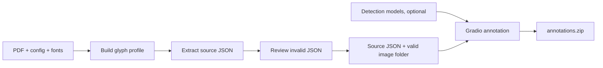

# SinoNom Annotation

<p align="center">
  <strong>Tools for extracting structured Vietnamese inscription content from PDF files and annotating Hán/Nôm characters in images.</strong>
</p>

<p align="center">
  <a href="requirements.txt">
    
  </a>
  <a href="gradio/requirements.txt">
    
  </a>
</p>

---

## Introduction

SinoNom Annotation is a toolset for extracting structured inscription text from PDFs and preparing Hán/Nôm character annotations from images. It includes PDF font decoding, record validation, optional text-box detection and a Gradio-based annotation workflow.

> **Gradio implementation note:** The annotation app was built through vibe coding. Its code is not cleanly structured and can be difficult to maintain or modify. Use it as a project-specific tool; its interface and implementation are not recommended as design or architecture references.

## 📑 Table of Contents

- [SinoNom Annotation](#sinonom-annotation)
  - [Introduction](#introduction)
  - [📑 Table of Contents](#-table-of-contents)
  - [🧩 Components](#-components)
  - [🔄 Processing Flow](#-processing-flow)
  - [⚙️ Installation](#️-installation)
  - [📄 PDF Text Extraction](#-pdf-text-extraction)
    - [Configuration](#configuration)
      - [Config file](#config-file)
      - [Input and output paths](#input-and-output-paths)
      - [Font decoding](#font-decoding)
      - [Preparing reference fonts](#preparing-reference-fonts)
      - [Page filtering](#page-filtering)
      - [Inscription parsing](#inscription-parsing)
  - [🔍 Detection Models](#-detection-models)
    - [Difference from the original AutoHDR fusion](#difference-from-the-original-autohdr-fusion)
  - [🖥️ Gradio Annotation App](#️-gradio-annotation-app)
    - [Workflow](#workflow)
    - [Saving](#saving)
    - [Gradio Output Format](#gradio-output-format)
      - [`text_annotations.json`](#text_annotationsjson)
      - [`source_mismatches.json`](#source_mismatchesjson)
      - [`suspicious_details.json`](#suspicious_detailsjson)
      - [`inscription_content.json`](#inscription_contentjson)
  - [📦 Outputs](#-outputs)
  - [🗂️ Repository Layout](#️-repository-layout)

---

## 🧩 Components

| Component | Purpose |
| --- | --- |
| `text_extraction/` | Decodes embedded Type0 CID glyphs and converts PDF content into structured JSON |
| `text_detection/` | Detects intact and damaged character boxes and proposes an initial reading order. It does not recognize characters |
| `gradio/` | Six-stage interface for content verification, box editing and sorting, status and character assignment, crop and review |

> **Note**
>
> The Gradio app consumes extraction JSON. It does not extract text directly from a PDF.

---

## 🔄 Processing Flow

Before starting, prepare:

- One source PDF
- One document config based on [`configs/tap_1.json`](configs/tap_1.json), adapted to the document's paths, fonts, headings and layout
- A flat image folder whose filename stems match the inscription `ky_hieu` values (Inscription Number)
- Matching reference fonts in `fonts/`
- Detection checkpoints and the OCR executable only when automatic box detection is needed


```mermaid
flowchart LR
    A[PDF + config + fonts] --> B[Build glyph profile]
    B --> C[Extract source JSON]
    C --> D[Review invalid JSON]
    D --> E[Source JSON + valid image folder]
    M[Detection models, optional] --> F[Gradio annotation]
    E --> F
    F --> G[annotations.zip]
```

| Step | Required Input | Result |
| --- | --- | --- |
| Build Glyph Profile | PDF, document config and reference fonts | CID-to-Unicode glyph profile |
| Extract Text | PDF, config and glyph profile | Source JSON plus `_invalid.json` for manual review |
| Prepare Images | Flat image folder and valid `ky_hieu` values | Images with invalid/missing source records removed |
| Run Gradio | Valid image folder and extracted source JSON | Content verification and character annotation workflow |
| Automatic Detection | The three model assets in their default folders | Initial intact/damaged regions; review the boxes and assign their reading order in Gradio |
| Save Results | Verified content and completed Review steps | `annotations.zip`, saved in the configured output folder and downloaded by the browser |

---

## ⚙️ Installation

The complete runtime targets **Linux x86_64**, **Python 3.11** and **CUDA 12.1**:

```bash
python -m pip install -r requirements.txt
```

This installs PDF extraction, Gradio, PyTorch, MMCV and MMDetection. The Torch/MMCV versions are intentionally pinned together. A clean environment is recommended.

For manual annotation without installing the detection-model dependencies:

```bash
python -m pip install -r gradio/requirements.txt
```

Start the Gradio app with detection disabled:

```bash
python gradio/app.py --skip-detection
```

This runs the normal annotation app and lets you draw boxes manually. Detection remains available when the app is started without `--skip-detection` and its model assets are installed.

---

## 📄 PDF Text Extraction

Extraction is config-driven. [`configs/tap_1.json`](configs/tap_1.json) is the reference configuration and defines:

- Source PDF, glyph profile and output paths
- Page margins and footnote filtering
- Record titles and metadata fields
- Face-marker syntax
- Allowed content sections
- Gradio image input and annotation output directories

### Configuration

#### Config file

The config describes one PDF collection: where its files are located, how its pages are parsed, and where Gradio reads and writes data. Start from [`configs/tap_1.json`](configs/tap_1.json) and create a separate config when processing a document with different paths, fonts, headings or parsing rules.

All relative paths written inside the config are resolved from the directory containing that config file. For example, `../data/images` in `configs/tap_1.json` resolves to `data/images` at the repository root.

#### Input and output paths

| Field | Input/Output | Meaning and When It Is Used |
| --- | --- | --- |
| `input_pdf_path` | Input | The source PDF used to build the glyph profile and extract inscription text. Change this for each new PDF |
| `paths.glyph_profile` | Intermediate | JSON mapping from embedded PDF glyphs/CIDs to Unicode. The profile builder writes it, then text extraction reads it. Use a profile generated from the same PDF and font set |
| `paths.output_json` | Output, then input | Where extracted inscription records are written. Gradio later reads this file as source content unless `--source-json` is supplied |
| `gradio.image_dir` | Input | Flat folder of inscription images shown in Gradio. Each filename stem must match exactly one `ky_hieu` in `paths.output_json`. Override with `--image-dir` |
| `gradio.output_dir` | Output | Working output folder for per-image annotations, internal committed state and `annotations.zip`. Override with `--output-dir` |

#### Font decoding

| Field | Meaning and When It Is Used |
| --- | --- |
| `encoded_fonts` | Maps embedded PDF font names to local Unicode reference-font files. Font discovery refreshes this mapping before glyph-profile generation and text extraction. Update the available reference fonts when the PDF uses a different embedded font set |

#### Preparing reference fonts

Reference fonts are local Unicode fonts used to match embedded CID glyph outlines to Unicode characters. The repository does not download them automatically because font licensing and redistribution terms vary.

First, list the unique embedded Type0/Identity font names used by the PDF:

```bash
python helpers/list_pdf_fonts.py /path/to/document.pdf
```

Example output:

```text
Cambria-Bold
NomNaTong
PalatinoLinotype
```

Use `--json` when a machine-readable list is more convenient:

```bash
python helpers/list_pdf_fonts.py /path/to/document.pdf --json
```

Obtain Unicode reference-font files for the reported families and styles, then place the `.ttf`, `.otf`, `.ttc` or `.otc` files in [`fonts/`](fonts/). The internal family/style metadata of each file must match the embedded PDF font name; matching only the filename is not sufficient.

Next, match the PDF fonts against the local files and update `encoded_fonts` in the config:

```bash
python -m text_extraction.font_discovery \
  --config configs/tap_1.json
```

The command reports fonts for which no matching local reference exists. Once every required font is matched, build the glyph profile as described below. Both glyph-profile generation and text extraction also run this synchronization automatically, but the standalone command is useful for checking reference fonts before processing.

#### Page filtering

| Field | Meaning and When It Is Used |
| --- | --- |
| `page_filter.margins.top` | Height removed from the top of every PDF page before record parsing |
| `page_filter.margins.bottom` | Height removed from the bottom of every PDF page before record parsing |
| `page_filter.footnotes` | Footnote detection using `start_pattern` and `max_font_size`; use `null` to disable footnote filtering |

`page_filter.margins.top` and `.bottom` are numeric PDF-coordinate heights. `page_filter.footnotes` removes matching small-text footnotes; set the entire field to `null` when the document has no compatible footnote pattern.

#### Inscription parsing

| Field | Meaning and When It Is Used |
| --- | --- |
| `records.title_pattern` | Regular expression identifying the start of an inscription record. It must provide the named group `number` |
| `records.metadata` | Declares metadata headings, output field names, value type and whether each field is required |
| `records.content.start_heading` | Heading that marks the start of content sections |
| `records.content.section_headings` | Exact section headings recognized by extraction. Only `records.content.start_heading` (`Nguyên văn chữ Hán Nôm`) must have nonblank text on every image face; other configured sections may be absent |
| `records.face_marker_pattern` | Regular expression mapping content to an inscription face/image. It must provide the named group `id`, which becomes `ky_hieu` |
| `records.require_consecutive_numbers` | When `true`, non-consecutive or duplicate inscription numbers are reported in `_invalid.json` |

Build the glyph profile, then extract the PDF:

```bash
python -m text_extraction.glyph_profile \
  --config configs/tap_1.json

python -m text_extraction.main \
  --config configs/tap_1.json
```

To process every PDF directly inside `input/` with its matching `configs/tap_N.json`, run:

```bash
python scripts/extract_input_pdfs.py
```

Use `--only Tap-3` to process filenames containing a selected fragment. The batch script uses each volume's own config for font mappings, glyph profile and output paths. It writes one extraction summary to `output/extraction_summary.txt`; it reports the record counts in each primary JSON and `_invalid.json`, the inscription numbers included in the review file, and the numbers whose records are missing the “Nguyên văn chữ Hán Nôm” section.

To combine each volume's valid extraction records with its `manual-review` and `tag-corrected` records, run:

```bash
python3 scripts/merge_record_files.py
```

The script reads matching files from `examples/` and `output/`, then writes one `<volume-prefix>.json` per volume into `merged_records/`. For duplicate face IDs, `manual-review` takes priority over `tag-corrected`, which takes priority over the valid extraction. Before choosing a winner, it keeps only faces with a usable `ky_hieu` and exactly one configured source heading whose `van_ban` is a string; this matches Gradio's source-face lookup requirement. If `--image-dir` is provided, faces without a matching image are also skipped. Source files are left unchanged. A custom output directory can be provided with `--output-dir`.

Check whether the merged JSON files can be used as Gradio source files:

```bash
python3 scripts/check_merged_records.py
```

To also verify that each image filename maps to exactly one face, provide the image folder:

```bash
python3 scripts/check_merged_records.py --image-dir /path/to/images
```

The checker uses each volume's `configs/tap_N.json` content heading and reports invalid records, duplicate face IDs and image/source mismatches.

Both commands discover compatible embedded/reference fonts and refresh `encoded_fonts`. Paths inside a config are resolved relative to that config file.

Glyph-profile runtime depends primarily on the number of glyphs in the configured reference fonts, not only on the PDF page count. Large CJK fonts may contain tens of thousands of candidates even when the PDF has only a few pages. The builder first attempts an exact normalized-outline signature match, which avoids rasterization when the embedded and reference outlines are identical. Only unresolved glyphs use visual matching; reference glyphs are rasterized once per font and L1 pixel scores are then computed with NumPy in bounded batches. Log output reports when this slower fallback is required. Reuse the generated profile for subsequent extractions from the same PDF/font set instead of rebuilding it for every run.

The primary output is a UTF-8 JSON array:

```json
[
  {
    "so_van_bia": 1,
    "ten_bia": "[Vô đề]",
    "ky_hieu_vnchn": ["12305"],
    "noi_dung": [
      {
        "ky_hieu": "12305",
        "chuyen_muc": [
          {
            "tieu_de": "Nguyên văn chữ Hán Nôm",
            "van_ban": "永寺樂"
          }
        ]
      }
    ]
  }
]
```

Extraction also creates `<output-stem>_invalid.json` containing records with errors or warnings, plus sequence issues. A record enters the primary JSON only when it has no errors or warnings and every `ky_hieu_vnchn` identifier has exactly one nonblank `Nguyên văn chữ Hán Nôm` section. `Phiên âm Hán Việt` and `Toát yếu` may be absent. Records that fail these checks appear in the review file and are excluded from the primary JSON.

---

## 🔍 Detection Models

Place external model assets at the default paths:

```text
text_detection/models/
├── ckpts/
│   ├── damage_detect.py
│   └── damage_detect.pth
└── dists/
    └── det_model/
        └── det_model
```

Make the OCR executable runnable on Linux:

```bash
chmod +x text_detection/models/dists/det_model/det_model
```

With this layout, Gradio needs no model-path arguments. The packaged OCR subprocess is quiet by default, including PyInstaller `PyiFrozenFinder` output. Use `--show-detection-logs` only for startup debugging.

The config and checkpoint must come from the same AutoHDR release. The OCR executable must match the host operating system and architecture. The pinned runtime uses Torch 2.1.0/cu121, MMCV 2.1.0, MMEngine 0.10.5 and MMDetection 3.3.0; MMDetection 3.3.0 requires MMCV below 2.2.0. Use full `mmcv`, not `mmcv-lite`, because detection requires compiled operations.

> [!NOTE]
> The damaged-character detection using **DINO**, ordinary character detection, and reading-order arrangement used in this project are based on components from the [AutoHDR repository](https://github.com/SCUT-DLVCLab/AutoHDR). Refer to the original repository for additional details about these detection and reading-order components.

Detection performs four operations:

1. Locate ordinary character boxes with the OCR detector
2. Locate damaged-character boxes with DINO
3. Remove an ordinary box when its IoU with a damaged box is at least `0.5`; when a small damaged box is contained within a larger ordinary character box, promote the larger box to `damaged`
4. Fuse the remaining boxes and propose a layout-aware reading order

### Difference from the original AutoHDR fusion

This repository intentionally modifies the fusion rule used by the original AutoHDR pipeline. The detection models are unchanged; the difference is only in the post-processing of DINO damaged-region boxes and OCR character boxes.

| Case | Original AutoHDR fusion | Fusion in this repository |
|---|---|---|
| Damaged box and OCR box have IoU ≥ `0.5` | Remove the OCR box and keep the DINO damaged-box geometry | Same behavior: remove the OCR box and keep the DINO box as `damaged` |
| A small damaged box is contained in a substantially larger OCR box, so standard IoU is below `0.5` | Keep both boxes because the IoU threshold is not reached | If their intersection covers at least `80%` of the smaller box, remove the small DINO box and promote the larger OCR box to `damaged` |

The containment extension is needed because standard IoU can be low even when a small DINO damage detection lies entirely inside the OCR box for the same character. Keeping both produces a small red box inside a large green box. Promoting the OCR geometry instead produces one full-character red box, which is the intended annotation region. For example, a damaged box `[15, 15, 25, 25]` inside an OCR box `[10, 10, 30, 30]` has IoU `0.25` but smaller-box coverage `1.0`; the fused output is therefore `[10, 10, 30, 30]` with status `damaged`.

This is a project-specific post-processing deviation from the original AutoHDR fusion and should be taken into account when comparing detection counts or bounding-box geometry with results produced directly by AutoHDR.

Run detection for one image independently:

```bash
python -m text_detection path/to/image.jpg \
  --output output/detection.json
```

The detection result uses stable one-based IDs and original-image `xyxy` coordinates:

```json
{
  "image": "12305.jpg",
  "bounding_boxes": {
    "1": {
      "bbox": [120, 450, 180, 520],
      "status": "damaged"
    },
    "2": {
      "bbox": [120, 350, 180, 420],
      "status": "intact"
    }
  },
  "reading_order": [2, 1]
}
```

For Python integrations, `text_detection.run_detection_pipeline()` returns a `DetectionResult` with `ocr_boxes`, `damage_boxes`, `normal_boxes`, `fused_boxes` and `ordered_boxes`. `iter_detection_pipeline()` additionally emits progress phases for model loading, preprocessing, detection, fusion and reading order.

If an external DINO config imports unavailable dataset-only modules such as `mmdet.datasets.fssj` or `mmdet.datasets.hdr`, remove those dataset imports for inference while preserving custom model and transform imports.

---

## 🖥️ Gradio Annotation App

Image files must be directly inside one flat folder. Each filename stem must match one `ky_hieu` in the source JSON and must be unique.

When CLI paths are omitted, Gradio reads them from the document config:

```json
{
  "paths": {
    "output_json": "../output/tap_1.json",
    "glyph_profile": "../data/glyph_profiles/tap1-short_1.json"
  },
  "gradio": {
    "image_dir": "../data/images",
    "output_dir": "../data/annotations"
  }
}
```

`paths.output_json` becomes the source JSON. `gradio.image_dir` and `gradio.output_dir` provide the image and annotation folders. Relative paths are resolved from the config file location.
The source JSON is read-only input. **Save Annotation** writes per-image results and verified content under `gradio.output_dir`; **Download All** packages those saved records. Reopening an image restores its saved content from the output registry, without changing the input JSON.

In this example:

- `../output/tap_1.json` is first created by PDF extraction, then read by Gradio as source content
- `../data/glyph_profiles/tap1-short_1.json` stores the CID-to-Unicode profile used during extraction
- `../data/images` contains the images shown in the annotation interface
- `../data/annotations` receives per-image annotation files and internal Save-all state

Run entirely from the default `configs/tap_1.json`:

```bash
python gradio/app.py
```

Use another config or override any path individually. Explicit CLI parameters always take priority:

```bash
python gradio/app.py \
  --config /path/to/config.json \
  --image-dir /override/images \
  --output-dir /override/annotations
```

The Content screen exposes the configured fields from the selected inscription face. The standard content sections are:

| Source Section | UI Label |
| --- | --- |
| `Nguyên văn chữ Hán Nôm` | Nguyên văn chữ Hán Nôm |
| `Phiên âm Hán Việt` | Phiên âm Hán Việt |
| `Dịch nghĩa` | Dịch nghĩa |
| `Toát yếu` | Toát yếu |
| `Chú thích` | Chú thích |

The original Hán/Nôm section is the character-annotation source. Only fields present in the selected face are shown; the app does not invent missing sections or expose another face's content. Configured metadata fields may also appear when `gradio.show_metadata_fields` is enabled.

```bash
python gradio/app.py \
  --image-dir /path/to/images \
  --source-json /path/to/extracted-source.json \
  --output-dir /path/to/annotations
```

To run the Gradio app for manual annotation without loading detection models:

```bash
python gradio/app.py --skip-detection
```

The app uses `configs/tap_1.json` by default. Add normal Gradio app options as needed,
for example `python gradio/app.py --skip-detection --port 7861`.

When `--port` is omitted, Gradio automatically selects the first available local port,
so an existing process on port `7860` does not prevent the app from starting.

For custom data paths, either edit the config or override individual paths:

```bash
python gradio/app.py --skip-detection \
  --image-dir /path/to/images \
  --source-json /path/to/extracted-source.json \
  --output-dir /path/to/annotations
```

Open the local URL printed by Gradio (normally `http://127.0.0.1:7860`; a later free port is used when necessary). For a remote environment:

```text
--server-name 0.0.0.0 --share
```

### Workflow

1. **Image** — Select an image from the configured folder and choose **Start Verification**.
2. **Content** — Verify the source fields for that image. Only sections present in the source face appear; the original Hán/Nôm text supplies the character sequence.
3. **Bounding Boxes & Sort** — Run detection or edit boxes manually, check the box and character counts, resolve any source mismatch, and assign a complete box order.
4. **Status & Order** — Review each box's `intact`/`damaged` status, assign `unknown` only to damaged boxes when needed, arrange the character cards, and flag suspicious characters.
5. **Crop** — Adjust the orange crop frame. Export scales crops longer than 4096 pixels down proportionally and records the scale factors.
6. **Review** — Inspect the final image and JSON, then choose **Save Annotation**.

The browser keeps geometry, selection, order, character and crop edits locally during interaction. **Next** validates and commits the relevant snapshot to the Python session. In the box stage, **Sort Boxes** can order all boxes or only the selected boxes; an existing order prompts before it is overwritten. A single selected box can also be given an order number manually. **Clear Order** removes the order from selected boxes, or from all boxes when none are selected. It leaves the boxes and any confirmed source mismatch unchanged, so the boxes can be sorted again. **Next** requires a complete, unique `1..n` order before leaving this stage.

Sorting is available after Content verification when the box and character counts match, or when a source mismatch has been confirmed for the current text and box count. If the counts differ, choose **Missing Content** when there are more boxes than characters or **Extra Content** when there are more characters than boxes. Choose **Other** for a source issue that cannot be mapped, including one where the counts match. Press **Confirm Mismatch**; **Clear** removes the confirmation. Changing the box count invalidates a previous confirmation and requires confirming again. Changing only the order does not. The **Next** action can also confirm the selected mismatch type after committing the current boxes. **Other** requires a note and goes directly from the box stage to Review.

For **Missing Content**, the app adds `MISS` character cards until every box has a card. For **Extra Content**, all source characters can be rearranged; characters beyond the box count are saved as `excluded_characters`. Character cards can be dragged in **Status & Order** to assign them to the numbered boxes without moving box geometry. A `MISS` card marks missing source content; it is not a box status and does not force `unknown`. Boxes retain `intact` or `damaged`, while `unknown` is a separate flag available only for damaged boxes. A suspicious flag follows its character card when it moves and is resolved to the final Box ID when saving.

Box editing is immediate in the browser: click or drag to select, use Ctrl/Cmd-click for multiple selection, Alt/Option-drag to draw a box, or drag and resize existing boxes. **Delete Selected** and **Run Detection** update the box set; detection asks before replacing existing boxes. Entering coordinates in the sidebar or using **Next** commits the live geometry. Surviving regions keep their reviewed status. Internal region and character-token IDs are not written to output JSON. **Box color** changes only the editor's visual outline palette.

In **Status & Order**, boxes are selectable but cannot be moved, resized, created or deleted. The character cards and status controls update the local preview; **Next** commits their final arrangement and statuses before Crop.

Crop dragging follows the same model: moving, resizing, or drawing the orange frame updates only local state and never opens a loading modal. **Next** snapshots the live frame and submits the coordinate textbox directly. The desktop and mobile layouts use normal page scrolling rather than clipping long content into a fixed-height application shell.

Review renders the cropped image viewport from the accepted crop coordinates after drawing the annotation overlays. Bounding boxes retain their original image-space coordinates and are clipped together with the source image at the crop boundary; export data is not rewritten into crop-relative coordinates.

Hán/Nôm text in the interface is rendered with locally served NomNaTong and DengXian fonts.

### Saving

- **Start Verification** opens the image selected in the **Image** dropdown
- **Save change** applies the currently displayed Content editor value to the selected section
- **Undo changes** restores the current Content draft
- Content edits stay in the current Gradio session until **Save Annotation**
- **Back** returns to the preceding applicable workflow step
- **Next** on Content (Step 2) applies the currently displayed editor text to session state before entering Bounding Boxes (Step 3). Use **Save change** before switching sections; **Next** also includes previously applied edits.
- **Next** on Bounding Boxes & Sort commits the live geometry and box order, validates the box/character relationship, and confirms the selected mismatch type when needed
- **Next** on Status & Order commits the character-card arrangement and complete box-status map before Crop
- **Apply Changes** on Status & Order redraws the browser preview, including `MISS` marks; **Next** commits the current state to the session
- **Next** on Crop commits the current local orange frame; oversized crops are scaled only when the output document is built
- **Save Annotation** on Review is the only action that writes durable image data. It commits verified content to the output registry, then saves either a normal annotation or a source-mismatch record. The two forms are mutually exclusive for each image; the input source JSON is unchanged
- **Download All** is enabled only after an annotation or source-mismatch record has been saved. Existing records from earlier app launches count. When enabled, it creates `annotations.zip` in `gradio.output_dir` and downloads the same archive in the browser. The archive contains:
  - `text_annotations.json` for images committed with **Save Annotation**
  - `inscription_content.json` for images committed with **Save Annotation**
  - `source_mismatches.json` for images explicitly confirmed as source errors
  - `suspicious_details.json` for saved images containing suspicious Box IDs
- **History** opens a locally searchable list of configured images with Done and Not Done filters; each opening refreshes the saved-record status

> **Note**
>
> Drafts stay in the current Gradio session and are never included until **Save Annotation** is used.

### Gradio Output Format

**Download All** writes and downloads one archive:

```text
annotations.zip
├── text_annotations.json
├── inscription_content.json
├── source_mismatches.json
└── suspicious_details.json
```

The three primary datasets are UTF-8 JSON arrays with one object per committed image. `suspicious_details.json` is an object keyed by inscription identifier. If a category has no committed data, its corresponding file is omitted from the ZIP.

#### `text_annotations.json`

This file contains only images committed with **Save Annotation** on the Review step. Box IDs are contiguous from `1` to `n`. Sorting and manually assigning order numbers determine those IDs; arranging character cards in **Status & Order** changes the character-to-box mapping without moving box geometry or changing its reviewed status.

When at least one box is suspicious, the record also contains `"issue_type": ["suspicious_content"]`; the affected Box IDs are stored only in `suspicious_details.json`.

```json
[
  {
    "image": "12305.jpg",
    "bounding_boxes": {
      "1": {
        "bbox": [120, 350, 180, 420],
        "status": "intact"
      },
      "2": {
        "bbox": [120, 450, 180, 520],
        "status": "damaged"
      },
      "3": {
        "bbox": [220, 350, 280, 420],
        "status": "intact"
      }
    },
    "annotations": {
      "1": "永",
      "2": "樂",
      "3": "寺"
    },
    "image_resize": {
      "source_size": [5000, 3000],
      "output_size": [4096, 2458],
      "scale_x": 0.8192,
      "scale_y": 0.81933333
    },
    "crop": {
      "top_left": [0, 0],
      "top_right": [4096, 0],
      "bottom_right": [4096, 2458],
      "bottom_left": [0, 2458]
    }
  }
]
```

The `annotations` object is the final character-to-box mapping. Annotation files do not write a redundant `reading_order` field.

#### `source_mismatches.json`

This optional file contains saved images with a confirmed source mismatch. **Missing Content** records have more boxes than source characters and include `MISS` annotations. **Extra Content** records have more source characters than boxes and include `text_sequence` and `excluded_characters` alongside the mapped annotations. **Other** records use a minimal form with a note and box coordinates, without character annotations.

For example, the relevant fields of a record with four boxes and three source characters may contain:

```json
{
  "source_character_count": 3,
  "bounding_box_count": 4,
  "issue_type": ["missing_text"],
  "annotations": {
    "1": "永",
    "2": "MISS",
    "3": "寺",
    "4": "樂"
  }
}
```

Moving the `MISS` card changes its final Box ID assignment and shifts the intervening character assignments. The destination box keeps its reviewed `intact` or `damaged` status. `MISS` is stored as an annotation value and marked on the canvas, not as an `unknown` status.

```json
[
  {
    "image": "12306.jpg",
    "inscription_code": "12306",
    "issue_type": ["other"],
    "note": "The extracted source does not match the inscription face.",
    "bounding_boxes": {
      "1": {"bbox": [120, 350, 180, 420]},
      "2": {"bbox": [120, 450, 180, 520]}
    }
  }
]
```

#### `suspicious_details.json`

This optional object is keyed by the existing inscription identifier. It contains one consolidated record per saved image with suspicious annotations; character content and geometry remain in the normal annotation document.

```json
{
  "12305": {
    "issue_type": "suspicious_content",
    "box_ids": [2, 5],
    "note": "Content may be incorrect."
  }
}
```

#### `inscription_content.json`

This file contains only images committed with **Save Annotation**. It stores the image name, matching inscription/face code and the five supported content sections. A section absent from the extracted source is represented by `null`.

```json
[
  {
    "image": "12305.jpg",
    "inscription_code": "12305",
    "content": {
      "Nguyên văn chữ Hán Nôm": "永寺樂",
      "Phiên âm Hán Việt": "Vĩnh tự lạc",
      "Dịch nghĩa": "...",
      "Toát yếu": "...",
      "Chú thích": null
    }
  }
]
```

---

## 📦 Outputs

```text
annotations/
├── 12305.json          # Boxes, statuses, final annotations and crop
├── source_mismatches/
│   └── 12306.json      # Source issue; MISS/extra-text mapping or minimal Other record
├── suspicious_details.json # Suspicious Box IDs keyed by inscription identifier
├── annotations.zip     # Download All archive, also downloaded by the browser
└── .state/
    ├── 12305.json      # Text/document fingerprints used to verify committed data
    ├── source_mismatches/
    │   └── 12306.json  # Source-mismatch document fingerprint
    └── content.json    # Internal Save-all content registry
```
In this example, `12305` is the number of the corresponding inscription

All JSON is written as UTF-8 with readable Unicode. Per-image annotation writes are atomic.

Bounding boxes and the editable crop frame remain in original-image coordinates. There is no manual source-image resize handle. At save time, a crop whose longest side exceeds 4096 pixels is scaled down proportionally; `image_resize` records `source_size`, `output_size`, `scale_x`, and `scale_y`, while the saved crop corners use the scaled output coordinate system. `scale_x` and `scale_y` can differ very slightly because output dimensions must be rounded to whole pixels. Source updates use an in-process lock and baseline comparison; the application is intended to run as one server process, and concurrent edits of the same image should be avoided.

---

## 🗂️ Repository Layout

```text
configs/                 Document-specific extraction rules
fonts/                   Unicode reference fonts and Hán/Nôm UI fonts
helpers/                 Small command-line utilities for data preparation
text_extraction/         PDF decoding, glyph profiles and record parsing
text_detection/          OCR/damage localization and reading-order proposal
gradio/                  Annotation application and UI assets
requirements.txt         Complete Python 3.11/CUDA 12.1 runtime
```
