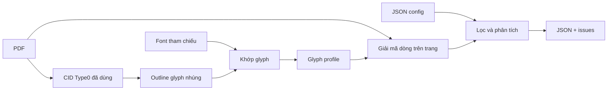

# Vietnamica Alignment

Trích xuất dữ liệu văn bia tiếng Việt có cấu trúc từ PDF có ánh xạ văn bản của font nhúng không đáng tin cậy.

[](pyproject.toml)
[](pyproject.toml)
[](#đầu-ra)

[🇬🇧 English](README.md)

> `trích xuất văn bản PDF` · `giải mã Type0 CID` · `glyph-outline profile` · `đầu ra JSON`

## Chức năng

Một số PDF lưu văn bản hiển thị dưới dạng character identifier (CID) trong font subset nhúng, thay vì ký tự Unicode đáng tin cậy. Vietnamica Alignment khôi phục glyph được hỗ trợ bằng cách khớp outline với glyph profile đã tạo, sau đó chuyển văn bản đã giải mã thành bản ghi JSON có cấu trúc.

Đầu vào gồm PDF, cấu hình tài liệu và glyph profile. Đầu ra là JSON array UTF-8 chứa các bản ghi văn bia, cùng tệp issue riêng để review. Dự án không dùng OCR và không sửa PDF nguồn.

## Bắt đầu nhanh

Yêu cầu: Python 3.10+, [uv](https://docs.astral.sh/uv/), dependency của dự án, và font tham chiếu phù hợp trong `fonts/reference/`.

```bash
uv sync --frozen
```

Tạo config cho tài liệu, xây glyph profile, rồi trích xuất:

```bash
uv run python tools/build_glyph_profiles.py \
  --pdf input/your-document.pdf \
  --output data/glyph_profiles/your-document.json \
  --config configs/your-document.json

uv run python extract_pdf.py \
  --config configs/your-document.json \
  --pretty-output output/your-document.pretty.json
```

Chạy lệnh từ thư mục gốc của kho. Profile builder không tạo thư mục cha cho `--output`; hãy tạo trước. Lệnh trích xuất có tạo thư mục cha cho đầu ra.

## Cách hoạt động



1. Profile builder quét tài nguyên Type0 đủ điều kiện và chỉ profile các CID thật sự có trong tài liệu.
2. Nó chuyển outline thành SVG path command, tạo SHA-256 signature ngắn, rồi chọn ứng viên Unicode từ font tham chiếu cục bộ phù hợp bằng so sánh raster.
3. Extractor tạo lại signature outline cho từng CID được hỗ trợ và tra ký tự Unicode trong profile.
4. Nó loại phần lề/footnote đã cấu hình, rồi phân tích tiêu đề, metadata, marker và chuyên mục thành bản ghi.

## Cấu hình

Dùng [`configs/tap_1.json`](configs/tap_1.json) làm ví dụ schema. `input_pdf`, `output_json`, `glyph_profile` được phân giải tương đối với tệp config.

```json
{
  "input_pdf": "../input/document.pdf",
  "output_json": "../output/document.json",
  "glyph_profile": "../data/glyph_profiles/document.json",
  "title_pattern": "^VĂN BIA SỐ\\s+(?P<number>\\d+)\\s*$",
  "content_start": "Nguyên văn chữ Hán Nôm",
  "content_sections": ["Nguyên văn chữ Hán Nôm", "Phiên âm Hán Việt"],
  "marker_pattern": "^\\s*<\\s*(?P<id>\\d+)\\s*>?\\s*(?P<rest>.*)$",
  "encoded_fonts": ["NomNaTong"],
  "metadata": [
    {"label": "Tên bia", "field": "ten_bia", "type": "string", "required": true}
  ]
}
```

| Field | Mục đích |
| --- | --- |
| `input_pdf`, `output_json`, `glyph_profile` | PDF nguồn, profile đã tạo và đường dẫn đầu ra. |
| `title_pattern` | Regex tiêu đề bản ghi; phải có group tên `number`. |
| `metadata` | Label metadata bắt buộc và field đầu ra. `identifiers` đọc giá trị `<digits>`. |
| `content_start`, `content_sections` | Heading bắt đầu nội dung và các heading chuyên mục được phép. |
| `marker_pattern` | Regex marker mặt bia; phải có group tên `id`. |
| `page_margins`, `footnote_filter` | Lọc dòng tùy chọn. |
| `expected_record_count`, `require_consecutive_numbers` | Kiểm tra toàn corpus tùy chọn, được báo dưới dạng issue. |

`encoded_fonts` chọn font khi xây profile. Ở decoder hiện tại nó được truyền vào nhưng không dùng để chặn giải mã, nên PDF nhiều font cần được review cẩn thận.

## Đầu ra

Đầu ra chính là một JSON array compact. Mỗi bản ghi kết thúc bằng `noi_dung`.

```json
[
  {
    "so_van_bia": 1,
    "ten_bia": "[Vô đề]",
    "ky_hieu_vnchn": ["12305"],
    "noi_dung": [
      {
        "ky_hieu": "12305",
        "chuyen_muc": [
          {"tieu_de": "Nguyên văn chữ Hán Nôm", "van_ban": "…"}
        ]
      }
    ]
  }
]
```

CLI cũng ghi mặc định `<output-stem>_invalid.json`. Tệp này chứa bản ghi malformed, cảnh báo parser và vi phạm số lượng/chuỗi toàn cục. Mặc định, bản ghi có cảnh báo parser bị loại khỏi đầu ra chính; dùng `--keep-flagged-records` để giữ lại.

### Tùy chọn trích xuất

| Tùy chọn | Mô tả |
| --- | --- |
| `--config PATH` | Config tài liệu bắt buộc. |
| `--pretty-output PATH` | Ghi bản sao thụt lề để review thủ công. |
| `--issues-output PATH` | Ghi đè đường dẫn tệp issue mặc định. |
| `--keep-flagged-records` | Giữ bản ghi có cảnh báo parser trong JSON chính. |
| `--content-layout preserve\|space\|no-space` | Giữ, nối bằng space, hoặc xóa line break trong `van_ban`. |
| `--strip-literal-backslashes` | Chỉ xóa backslash thực tế khỏi `van_ban`. |

## Bố cục dự án

| Đường dẫn | Mô tả |
| --- | --- |
| `extract_pdf.py` | CLI trích xuất chính. |
| `configs/` | Quy tắc parser và filter theo từng tài liệu. |
| `extraction/` | Code config, glyph, decoder, parser, JSON và workflow thư viện. |
| `tools/build_glyph_profiles.py` | Glyph-profile builder. |
| `tools/get_fonts.py` | Kiểm kê font PDF. |
| `tools/get_ref_font.py` | Kiểm tra metadata font tham chiếu. |
| `tools/test_font.py` | Helper render glyph hard-code. |
| `fonts/reference/` | Font Unicode tham chiếu cục bộ. |
| `tests/` | Unit và integration tests. |

## Giới hạn

- Profile builder chỉ hỗ trợ Type0 `cff`, `cid`, `ttf`, `otf` với CID hai byte `Identity-H`/`Identity-V`.
- Type1/font đơn giản, CMap không hỗ trợ, và `CIDToGIDMap` Type0 không identity không được giải mã.
- Raster matcher không có ngưỡng tin cậy; cần review profile đầu ra.
- Nhận dạng content stream xử lý các mẫu `Tf`/`Tj`/`TJ` cụ thể, không phải mọi cấu trúc PDF hợp lệ.
- `extraction.searchable_pdf.export_searchable_pdf()` là API thư viện, không phải lệnh CLI.

## Kiểm tra

```bash
uv run python -m unittest discover -s tests -v
```

Parser tests đều pass trong checkout này. Full suite hiện có hai vấn đề sẵn có của kho: một test import `tools/filter_unsupported_characters.py` bị thiếu, và config `tap_1` kỳ vọng 100 bản ghi trong khi PDF ngắn được cấu hình chỉ tạo một khoảng tiêu đề.

## Mở rộng

Với collection mới, hãy thêm config và glyph profile riêng trước khi sửa code. Khi cần hỗ trợ font/CMap hoặc text-show form mới, mở rộng `extraction/glyphs.py` và thêm test tập trung để profile builder và decoder vẫn tương thích.
