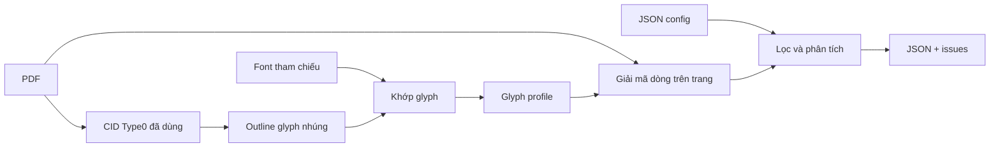

# Vietnamica Alignment

Trích xuất dữ liệu văn bia tiếng Việt có cấu trúc từ PDF có ánh xạ văn bản của font nhúng không đáng tin cậy.

[](pyproject.toml)
[](pyproject.toml)
[](#đầu-ra)

[🇬🇧 English](README.md)

> `trích xuất văn bản PDF` · `giải mã Type0 CID` · `glyph-outline profile` · `đầu ra JSON`

## Chức năng

Một số PDF lưu văn bản hiển thị dưới dạng character identifier (CID) trong font subset nhúng, thay vì ký tự Unicode đáng tin cậy. Vietnamica Alignment khôi phục glyph được hỗ trợ bằng cách khớp outline với glyph profile đã tạo, sau đó chuyển văn bản đã giải mã thành bản ghi JSON có cấu trúc.

Lệnh trích xuất nhận PDF và cấu hình tài liệu. Glyph profile là cache do `text_extraction.glyph_profile` tạo từ cùng PDF/config; đầu ra là JSON array UTF-8 chứa các bản ghi văn bia, cùng tệp issue riêng để review. Dự án không dùng OCR và không sửa PDF nguồn.

## Bắt đầu nhanh

Yêu cầu: Python 3.11+, [uv](https://docs.astral.sh/uv/), dependency của dự án, và font tham chiếu phù hợp trong `fonts/`.

```bash
uv sync --frozen
```

Tạo config cho tài liệu, xây glyph profile, rồi trích xuất:

```bash
uv run python -m text_extraction.glyph_profile \
  --config configs/your-document.json

uv run python -m text_extraction.main \
  --config configs/your-document.json
```

Cả hai lệnh đều tự dò font nhúng/reference phù hợp và cập nhật `encoded_fonts` trước. Lệnh profile ghi glyph profile; lệnh trích xuất ghi cả hai JSON đầu ra. Chạy lệnh từ thư mục gốc của kho.

## Text detection từ ảnh

`text_detection` là Stage 1 tùy chọn của AutoHDR: nhận một ảnh, phát hiện box ký tự thường và ký tự hư hỏng, gộp chúng rồi sắp xếp thứ tự đọc. CLI ghi một file JSON gồm box, trạng thái `intact`/`damaged` và danh sách ID theo thứ tự đọc; module không nhận dạng nội dung ký tự. Cách chạy, dependency và vị trí model được ghi tại [`text_detection/README.md`](text_detection/README.md).

## Cách hoạt động



1. Profile builder quét tài nguyên Type0 đủ điều kiện và chỉ profile các CID thật sự có trong tài liệu.
2. Nó chuyển outline thành SVG path command, tạo SHA-256 signature ngắn, rồi chọn ứng viên Unicode từ font tham chiếu cục bộ phù hợp bằng so sánh raster.
3. Extractor tạo lại signature outline cho từng CID được hỗ trợ và tra ký tự Unicode trong profile.
4. Nó loại phần lề/footnote đã cấu hình, rồi phân tích tiêu đề, metadata, marker và chuyên mục thành bản ghi.

## Cấu hình

Dùng [`configs/tap_1.json`](configs/tap_1.json) làm schema mẫu. PDF nguồn và mọi quy tắc theo tài liệu đều khai báo trong config. Các đường dẫn được phân giải tương đối với tệp config.

```json
{
  "input_pdf_path": "../input/document.pdf",
  "paths": {
    "output_json": "../output/document.json",
    "glyph_profile": "../data/glyph_profiles/document.json"
  },
  "encoded_fonts": {"NomNaTong": "../fonts/NomNaTong.ttf"},
  "page_filter": {
    "margins": {"top": 40.0, "bottom": 45.0},
    "footnotes": null
  },
  "records": {
    "title_pattern": "^VĂN BIA SỐ\\s+(?P<number>\\d+)\\s*$",
    "metadata": [
      {"label": "Tên bia", "field": "ten_bia", "type": "string", "required": true}
    ],
    "content": {
      "start_heading": "Nguyên văn chữ Hán Nôm",
      "section_headings": ["Nguyên văn chữ Hán Nôm", "Phiên âm Hán Việt"]
    },
    "face_marker_pattern": "^\\s*<\\s*(?P<id>\\d+)\\s*>?\\s*(?P<rest>.*)$",
    "require_consecutive_numbers": true
  }
}
```

| Field | Mục đích |
| --- | --- |
| `input_pdf_path` | PDF nguồn dùng để dò font, tạo profile và trích xuất text. |
| `paths` | Đường dẫn JSON kết quả và glyph profile được tạo ra. |
| `encoded_fonts` | Mapping tự sinh giữa tên font nhúng PDF và tệp font tham chiếu cục bộ chính xác. |
| `page_filter.margins` | Kích thước vùng lề trên/dưới cần loại rõ ràng. |
| `page_filter.footnotes` | Object gồm `start_pattern`, `max_font_size`, hoặc `null` để tắt lọc footnote. |
| `records.title_pattern` | Regex tiêu đề bản ghi; phải có group tên `number`. |
| `records.metadata` | Label metadata và field đầu ra. `identifiers` đọc giá trị `<digits>`. |
| `records.content` | Heading bắt đầu nội dung và các heading chuyên mục được phép. |
| `records.face_marker_pattern` | Regex marker mặt bia; phải có group tên `id`. |
| `records.require_consecutive_numbers` | Bật hoặc tắt rõ ràng kiểm tra số thứ tự liên tiếp. |

Trước mỗi lần chạy, pipeline quét PDF đã cấu hình và `fonts/`, rồi cập nhật `encoded_fonts` với mọi font khớp. Khi tạo profile, chương trình chỉ mở đúng các tệp đã ghi trong config, không quét lại `fonts/`. Field thừa, field schema cũ, hoặc field bị thiếu đều bị từ chối; code không có mặc định riêng cho tài liệu. `expected_record_count` đã bị bỏ vì nó gắn config dùng lại được với một phiên bản PDF/fixture cụ thể.

## Đầu ra

Đầu ra chính là một JSON array compact. Mỗi bản ghi kết thúc bằng `noi_dung`.

```json
[
  {
    "so_van_bia": 1,
    "ten_bia": "[Vô đề]",
    "ky_hieu_vnchn": ["12305"],
    "noi_dung": [
      {
        "ky_hieu": "12305",
        "chuyen_muc": [
          {"tieu_de": "Nguyên văn chữ Hán Nôm", "van_ban": "…"}
        ]
      }
    ]
  }
]
```

CLI cũng ghi mặc định `<output-stem>_invalid.json`. Tệp này chứa bản ghi malformed, cảnh báo parser và vi phạm chuỗi số thứ tự toàn cục. Mặc định, bản ghi có cảnh báo parser bị loại khỏi đầu ra chính.

### Tùy chọn trích xuất

| Tùy chọn | Mô tả |
| --- | --- |
| `--config PATH` | Config tài liệu bắt buộc. |

## Bố cục dự án

| Đường dẫn | Mô tả |
| --- | --- |
| `text_extraction/main.py` | Pipeline PDF → JSON theo config và CLI. |
| `text_extraction/font_discovery.py` | Dò font CID nhúng và cập nhật mapping đến tệp font tham chiếu cục bộ. |
| `text_extraction/glyph_profile.py` | Xây profile CID → Unicode từ các mapping đã cấu hình. |
| `text_extraction/config.py` | Đọc và kiểm tra config tài liệu cùng JSON glyph profile. |
| `text_extraction/types.py` | Các kiểu dữ liệu bất biến dùng chung trong pipeline. |
| `text_extraction/pdf_glyphs.py` | Đọc outline font nhúng, dùng chung cho tạo profile và decoder. |
| `text_extraction/parser.py` | Chuyển dòng text thành bản ghi văn bia và các lỗi cần review. |
| `text_extraction/output.py` | Kiểm tra, định dạng và ghi JSON nguyên tử. |
| `text_detection/` | Stage 1 AutoHDR tùy chọn: định vị box ký tự thường/hư hỏng, sắp xếp thứ tự đọc và ghi JSON một ảnh; không nhận dạng text. |
| `configs/` | Quy tắc parser và filter theo từng tài liệu. |
| `fonts/` | Font Unicode tham chiếu cục bộ. |
| `tests/` | Unit và integration tests. |

## Giới hạn

- Profile builder chỉ hỗ trợ Type0 `cff`, `cid`, `ttf`, `otf` với CID hai byte `Identity-H`/`Identity-V`.
- Type1/font đơn giản, CMap không hỗ trợ, và `CIDToGIDMap` Type0 không identity không được giải mã.
- Raster matcher không có ngưỡng tin cậy; cần review profile đầu ra.
- Nhận dạng content stream xử lý các mẫu `Tf`/`Tj`/`TJ` cụ thể, không phải mọi cấu trúc PDF hợp lệ.

## Kiểm tra

```bash
uv run python -m unittest discover -s tests -v
```

Test kiểm tra font discovery, profile utility, parser, JSON output và thứ tự đọc text-detection.

## Mở rộng

Với collection mới, hãy thêm config riêng gồm `input_pdf_path` và object `encoded_fonts` rỗng, rồi chạy `text_extraction.glyph_profile` trước `text_extraction.main`. Lệnh đầu sẽ dò font cục bộ tương thích và tạo profile. Khi cần hỗ trợ font/CMap hoặc text-show form mới, mở rộng `text_extraction/pdf_glyphs.py` và thêm test tập trung để discovery, profile builder và decoder vẫn tương thích.
