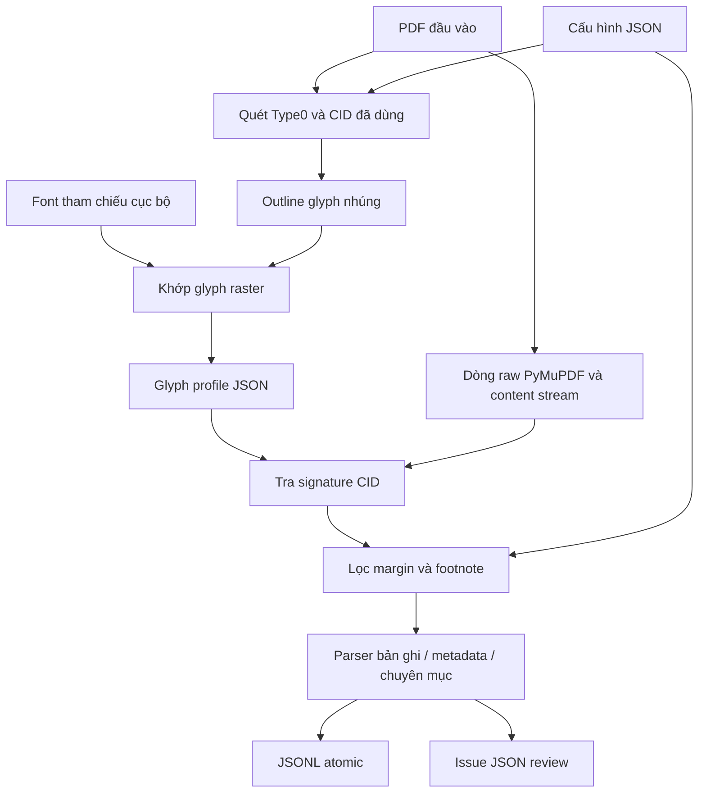

# Vietnamica Alignment

Trích xuất xác định được các bản ghi văn bia tiếng Việt có cấu trúc từ PDF có ánh xạ font nhúng không đáng tin cậy.

[🇬🇧 English](README.md)

## Tổng quan

Vietnamica Alignment chuyển PDF văn bia đã cấu hình thành JSONL UTF-8. Dự án nhắm tới PDF mà văn bản do thư viện trích xuất không đáng tin cậy với font subset nhúng: mã ký tự trên trang có thể là CID, không phải ký tự Unicode dự kiến.

Dự án xây glyph profile từ outline nhúng và font Unicode tham chiếu cục bộ. Khi trích xuất, hệ thống tạo lại outline signature của CID và dùng profile để khôi phục Unicode; sau đó lọc dòng và phân tích thành bản ghi văn bia. Đầu vào chính là PDF, cấu hình JSON và glyph profile. Đầu ra chính là JSONL được nhóm theo mặt bia và chuyên mục. Không dùng OCR.

## Động lực và bài toán

Văn bản PDF không mặc nhiên là Unicode. Trong font ghép Type0 có `Identity-H` hoặc `Identity-V`, mã hai byte là CID (Character Identifier): nó định vị glyph trong font đó, không tự động là code point Unicode. Vì vậy `/ToUnicode` hoặc ký tự do thư viện PDF trích xuất có thể thiếu hoặc không đáng tin cậy với font subset.

Với các dạng font được hỗ trợ, kho này:

1. Đọc tài nguyên Type0 và CID được hiển thị trong content stream PDF.
2. Lấy outline glyph CFF/CID hoặc TrueType/OpenType nhúng.
3. Chuyển outline thành SVG path command xác định được và băm SHA-256, cắt còn 24 ký tự hexa (glyph signature).
4. Khi xây profile, rasterize outline nhúng và outline từ font tham chiếu phù hợp; gán code point ứng viên có tổng chênh lệch tuyệt đối pixel thang xám thấp nhất.
5. Khi trích xuất, tra signature chính xác thay vì lặp lại khớp raster hoặc tin Unicode thô.

Việc chọn font tham chiếu chuẩn hóa family/style PDF và khớp family trong name table của `fonts/reference/`. Đây là quy tắc hiện thực, không chứng minh tính duy nhất về ngữ nghĩa: glyph giống hình hoặc font tham chiếu không phù hợp có thể cho ánh xạ mơ hồ/sai. Hãy review profile sinh ra khi dùng cho nghiên cứu hoặc corpus chất lượng cao.

## Mục tiêu

- Trích xuất văn bản theo thứ tự dòng mà không sửa PDF nguồn.
- Khôi phục Unicode cho CID nhúng được hỗ trợ từ outline-signature profile đã lưu.
- Giữ quy tắc phân tích riêng của tài liệu trong JSON.
- Ghi JSONL UTF-8 xác định được, đã kiểm tra, cùng artifact review.
- Giữ vấn đề cấu trúc có thể phục hồi để review trong khi tiếp tục bản ghi hợp lệ phía sau.
- Cung cấp helper kiểm tra font/glyph.

## Phi mục tiêu và giới hạn hiện tại

> [!WARNING]
> Đây không phải hệ thống PDF-sang-Unicode tổng quát.

- Chưa hiện thực OCR, PDF chỉ có ảnh, nhận dạng chữ viết tay, hay hiệu chỉnh bằng mô hình ngôn ngữ.
- Profile builder chỉ nhận Type0 `cff`, `cid`, `ttf`, hoặc `otf` có `Identity-H`/`Identity-V` và CID hai byte. Type1, font đơn giản và CMap khác bị loại trừ.
- `CIDToGIDMap` hiện diện ở Type0 TrueType/OpenType không được hỗ trợ; chỉ trường hợp identity/default được ánh xạ.
- Parser content stream chỉ nhận một số mẫu `Tf`/`Tj`/`TJ`; bố cục toán tử PDF hợp lệ khác phụ thuộc hiện thực.
- Không có ngưỡng điểm khớp raster, điểm tin cậy, hay xử lý mơ hồ tự động ngoài điểm thấp nhất.
- Profile phụ thuộc outline chính xác và phải được xây lại khi outline nhúng liên quan thay đổi.
- `encoded_fonts` lọc profile builder. Nó được truyền vào `GlyphDecoder`, nhưng decode path hiện tại không gọi `_is_encoded()` và thử outline Type0 hỗ trợ mà nó gặp.
- Parser metadata/chuyên mục dựa trên heading và regex, không phải hệ thống hiểu bố cục tổng quát.
- `export_searchable_pdf()` chỉ là hàm thư viện, không có CLI. Thông báo lỗi nhắc `tools/extract_ttc_face.py` nhưng script này bị thiếu.
- `tests/test_filter_unsupported_characters.py` tham chiếu `tools/filter_unsupported_characters.py` bị thiếu; tiện ích này không khả dụng trong checkout hiện tại.

## Tính năng

### Cốt lõi

- Kiểm tra config/profile JSON và đường dẫn tương đối với config.
- Xây profile chỉ cho CID đã dùng ở tài nguyên Type0 đủ điều kiện.
- Xử lý CFF/CID và Type0 TrueType/OpenType ánh xạ identity.
- Khôi phục CID-sang-Unicode dựa trên signature.
- Chuẩn hóa NFC, dọn ký tự không an toàn và whitespace.
- Phân tích bản ghi đánh số, metadata, marker mặt bia và chuyên mục đã cấu hình.

### Chi tiết hiện thực về hiệu năng

- Chọn CID đã dùng và loại trùng ứng viên cmap tham chiếu.
- Cache font tham chiếu đã chọn và glyph tham chiếu đã rasterize.
- Cache map/signature decoder theo xref font nhúng.
- Ghi JSONL atomic: tệp tạm được fsync rồi thay thế.

### Kiểm tra và gỡ lỗi

- Thống kê tổng hợp cùng log profile miss, fallback và ký tự unresolved.
- JSON issue cho bản ghi malformed, vi phạm số lượng/chuỗi và cảnh báo parser.
- JSONL xác định được, yêu cầu `noi_dung` là field cuối và từ chối Unicode không an toàn.
- Công cụ inventory font PDF, kiểm tra font tham chiếu và render glyph thủ công hard-code.

### Lệnh

| Lệnh | Mục đích |
| --- | --- |
| `python extract_pdf.py --config CONFIG` | Trích xuất JSONL và issue JSON. |
| `python tools/build_glyph_profiles.py --pdf PDF --output OUTPUT [--config CONFIG ...]` | Xây glyph profile. |
| `python tools/get_fonts.py` | Liệt kê mọi PDF trong `input/` của kho. |
| `python tools/get_ref_font.py` | Kiểm tra font tham chiếu tại đường dẫn hard-code. |
| `python tools/test_font.py` | Render code point review hard-code vào `unsupported_fonts/`. |

Chạy từ thư mục gốc kho. Ba công cụ cuối không có đối số CLI trong codebase hiện tại.

## Kiến trúc



| Thành phần | Trách nhiệm |
| --- | --- |
| `extract_pdf.py` | Điều phối CLI và ghi artifact. |
| `extraction/config.py` | Nạp/kiểm tra config và profile. |
| `extraction/glyphs.py` | Lấy outline, SVG command, signature. |
| `tools/build_glyph_profiles.py` | Quét CID, chọn tham chiếu, khớp raster, xuất profile. |
| `extraction/decoder.py` | Phân biệt tài nguyên font, giải mã CID, lọc dòng. |
| `extraction/records.py` | Phân tích bản ghi, metadata, chuyên mục, marker, issue. |
| `extraction/jsonl.py` | Dọn bố cục, kiểm tra, serialize, ghi atomic. |
| `extraction/service.py` | Điều phối workflow thư viện. |
| `extraction/searchable_pdf.py` | Xuất PDF tìm kiếm được ở mức thư viện, tùy chọn. |

## Yêu cầu và cài đặt

`pyproject.toml` yêu cầu Python 3.10+, `fonttools==4.65.0`, `pillow>=12.3.0`, và `pymupdf==1.28.2`; `.python-version` là 3.10 và có `uv.lock`.

```bash
uv sync --frozen
```

Xây profile cần font phù hợp trong `fonts/reference/`. PDF và profile được cấu hình phải tồn tại trước khi trích xuất. `input/`, `output/`, `data/` là thư mục artifact cục bộ bị ignore, không phải đầu vào được track.

## Bắt đầu nhanh

Từ thư mục gốc kho:

1. Thêm config tài liệu trong `configs/`.
2. Đảm bảo font tham chiếu phù hợp trong `fonts/reference/`.
3. Xây profile tài liệu.
4. Trích xuất và review log/issues.

```bash
uv run python tools/build_glyph_profiles.py \
  --pdf input/your-document.pdf \
  --output data/glyph_profiles/your-document.json \
  --config configs/your-document.json

uv run python extract_pdf.py \
  --config configs/your-document.json \
  --pretty-output output/your-document.pretty.json
```

Builder không tạo thư mục cha của `--output`; hãy tạo trước. CLI trích xuất có tạo thư mục cha của đầu ra.

## Cấu hình

`input_pdf`, `output_jsonl`, `glyph_profile` được phân giải tương đối với config. `--pdf`/`--output` của builder và `fonts/reference/` được phân giải từ thư mục làm việc tiến trình.

```json
{
  "input_pdf": "../input/document.pdf",
  "output_jsonl": "../output/document.jsonl",
  "glyph_profile": "../data/glyph_profiles/document.json",
  "title_pattern": "^VĂN BIA SỐ\\s+(?P<number>\\d+)\\s*$",
  "content_start": "Nguyên văn chữ Hán Nôm",
  "content_sections": ["Nguyên văn chữ Hán Nôm", "Phiên âm Hán Việt"],
  "marker_pattern": "^\\s*<\\s*(?P<id>\\d+)\\s*>?\\s*(?P<rest>.*)$",
  "encoded_fonts": ["NomNaTong"],
  "page_margins": {"top": 40, "bottom": 45},
  "metadata": [{"label":"Tên bia","field":"ten_bia","type":"string","required":true}]
}
```

| Field | Bắt buộc | Hành vi |
| --- | --- | --- |
| `input_pdf`, `output_jsonl`, `glyph_profile` | Có | Đường dẫn không rỗng, tương đối với config. |
| `metadata` | Có | Không rỗng; field duy nhất và không là `so_van_bia`/`noi_dung`. |
| `metadata[].label`, `field` | Có | Chuỗi không rỗng; label dung nạp biến thể accent/`Kí`/`Ký`/`Ð` đã hiện thực. |
| `metadata[].type` / `required` | Không | `string` mặc định hoặc `identifiers`; boolean mặc định `true`. Identifier lấy từ `<digits>`. |
| `title_pattern` | Không | Regex có `number` được đặt tên. |
| `content_start`, `content_sections` | Không | Heading bắt đầu nội dung và heading chuyên mục được phép. |
| `marker_pattern` | Không | Regex có `id`; `rest` tùy chọn là nội dung cùng dòng. |
| `encoded_fonts` | Không | Token chọn builder; xem giới hạn phía trên. |
| `page_margins` | Không | `top`/`bottom` không âm, mặc định 40/45 point; dòng cắt qua vùng bị bỏ. |
| `footnote_filter` | Không | Cần `start_pattern`; `max_font_size` dương tùy chọn. Dòng khớp đầu tiên và mọi dòng sau trên trang bị bỏ. |
| `expected_record_count` | Không | Số nguyên dương; lệch là issue toàn cục. |
| `require_consecutive_numbers` | Không | Boolean mặc định `true`; vi phạm là issue toàn cục. |

`title_pattern` và `marker_pattern` được compile khi nạp, lần lượt phải định nghĩa `(?P<number>...)` và `(?P<id>...)`.

## Glyph profile

Loader nhận đối tượng JSON không rỗng, key là signature. Nó yêu cầu field đúng kiểu dưới đây và kiểm tra `char == chr(codepoint)` cùng `unicode == U+<codepoint>`.

```json
{
  "0123456789abcdef01234567": {
    "glyph": "cid00168",
    "codepoint": 26481,
    "unicode": "U+6771",
    "char": "東"
  }
}
```

Builder quét content `Identity-H`/`Identity-V` đủ điều kiện lấy CID hai byte đã dùng, tìm font tham chiếu và chỉ profile các glyph đó. Outline rỗng ánh xạ U+0020; outline khác nhận code point cmap tham chiếu có điểm thấp nhất. Trích xuất tạo lại signature và lấy `char`; signature thiếu trở thành fallback/unresolved được log.

Hãy coi profile là bằng chứng được tạo ra, không phải character map phổ quát. Lưu PDF, config, tập font tham chiếu, profile, lệnh và output review cùng nhau để tái lập.

## Chạy trích xuất

```bash
uv run python extract_pdf.py --config configs/your-document.json
```

| Tùy chọn | Tác dụng |
| --- | --- |
| `--config PATH` | Config bắt buộc. |
| `--pretty-output PATH` | Ghi thêm JSON review có thụt lề. |
| `--issues-output PATH` | Ghi đè vị trí issue; mặc định `<stem>_invalid.json` cạnh JSONL. |
| `--keep-flagged-records` | Giữ bản ghi có cảnh báo parser trong JSONL. Bản ghi malformed không được xuất. |
| `--content-layout preserve\|space\|no-space` | Giữ, nối bằng space, hoặc xóa line break `van_ban`. |
| `--strip-literal-backslashes` | Chỉ xóa backslash thực tế khỏi `van_ban`, không đổi JSON escaping. |

CLI luôn ghi issue JSON. Mặc định nó loại bản ghi có số xuất hiện trong issue cảnh báo parser; cảnh báo parser in ra stderr, thống kê/sự kiện giải mã qua logging.

## Đầu ra và review

Mỗi dòng đầu ra chính là JSON compact; metadata đã cấu hình theo sau là `noi_dung` bắt buộc ở cuối.

```json
{"so_van_bia":1,"ten_bia":"[Vô đề]","ky_hieu_vnchn":["12305"],"noi_dung":[{"ky_hieu":"12305","chuyen_muc":[{"tieu_de":"Nguyên văn chữ Hán Nôm","van_ban":"…"}]}]}
```

| Field | Ý nghĩa |
| --- | --- |
| `so_van_bia` | Số do `title_pattern` bắt. |
| Metadata đã cấu hình | Chuỗi, hoặc array identifier với `identifiers`. |
| `noi_dung` | Mặt theo encounter/insertion order; `ky_hieu` có thể `null` khi không marker. |
| `chuyen_muc` | Object chứa `tieu_de` chuyên mục và `van_ban` nối bằng newline. |

Item issue có `so_van_bia`, `trang`, `loi`, `canh_bao`; nó chứa `van_bia` cho bản ghi đã parse có cảnh báo hoặc `du_lieu_nguon` cho bản ghi malformed. Cảnh báo gồm dòng trước metadata, marker không rõ/không marker, và marker khai báo nhưng không nhận nội dung. Thiếu heading bắt đầu nội dung hoặc metadata bắt buộc chỉ làm bản ghi đó malformed, nên khoảng phía sau vẫn parse.

## Tái lập và kiểm tra

```bash
uv run python -m unittest discover -s tests -v
```

Full suite của checkout này hiện chưa xanh:

- Thiếu `tools/filter_unsupported_characters.py` nên test module tương ứng không import được.
- `configs/tap_1.json` kỳ vọng 100 bản ghi, nhưng `input/tap1-short-21-page.pdf` đã cấu hình tạo một khoảng tiêu đề; integration test lỗi `Expected 100 records, found 1`.

PDF, profile và output tạo/cục bộ trong thư mục ignore có thể xem tại checkout này nhưng không được version-control bảo đảm. Hãy ghi lại đầu vào chính xác và so sánh kết quả `serialize_jsonl()` hoặc byte JSONL sau khi review profile và issue.

## Bố cục dự án

| Đường dẫn | Vai trò |
| --- | --- |
| `configs/tap_1.json` | Config ví dụ cho từng tài liệu. |
| `extract_pdf.py` | CLI chính và public re-export. |
| `extraction/` | Module config, glyph, decode, parse, output, searchable-PDF. |
| `tools/build_glyph_profiles.py` | Profile builder. |
| `tools/get_fonts.py`, `tools/get_ref_font.py`, `tools/test_font.py` | Helper kiểm tra/review. |
| `fonts/reference/` | Font tham chiếu của builder. |
| `tests/` | Unit test và sample integration test. |
| `input/`, `data/`, `output/` | Đầu vào, profile và kết quả cục bộ bị ignore. |
| `unsupported_fonts/` | PNG review thủ công đã commit. |

## Mở rộng

Với tài liệu mới, trước hết thêm config, heading/pattern phù hợp và profile riêng; sau đó review log và issue. Không dùng lại profile chỉ vì tên font giống nhau—tra cứu dùng outline signature chính xác.

Cần đổi code cho trường hợp font/CMap PDF mới, cú pháp text-show khác, `CIDToGIDMap` không identity, chính sách khớp/kiểm tra khác, hoặc mô hình đầu ra khác. Giữ hành vi outline dùng chung trong `extraction/glyphs.py` để builder và decoder tương thích, và thêm test cho cả diễn giải profile lẫn fallback khi trích xuất.
